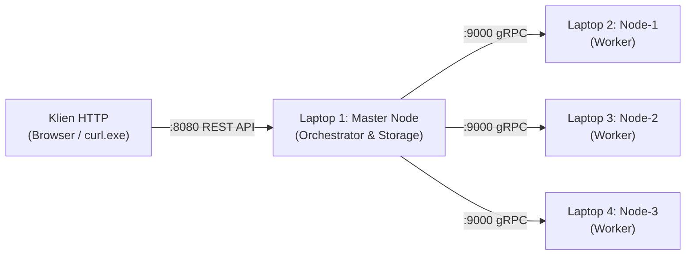

# distapi — Distributed Image Processing

**Mata Kuliah:** Sistem Terdistribusi (IF2228) · Program Studi Teknik Informatika · Universitas Trunojoyo Madura

## Tim Pengembang

| No | Nama | NIM | Peran / Bidang Tanggung Jawab |
|:---:|:---|:---:|:---|
| 1 | **Rafli Khiyanuran Bazhari** | 240411100001 | Scheduler Orchestrator, Algoritma Scatter-Gather, & Rescheduling |
| 2 | **Irma Annisatul Jannah** | 240411100014 | RPC Layer, Kontrak Protocol Buffers, & Failure Detector Heartbeat |
| 3 | **Muhammad Fajar Nugroho** | 240411100103 | RESTful API Gateway, Persistensi Storage Atomik, & Config 12-Factor |
| 4 | **Zakaria Mujur Prasetyo** | 240411100144 | Frontend Web Client & Pengujian Komparasi Citra |

## Ringkasan Eksekutif Sistem

`distapi` adalah sistem terdistribusi berbasis **Master-Slave** yang dirancang untuk menjalankan pemrosesan citra digital secara paralel pada 4 laptop bersistem operasi **native Windows**. Sistem diimplementasikan dalam bahasa pemrograman Go dan dikompilasi menjadi sebuah file biner mandiri tunggal (`distapi.exe`).

* **Komunikasi Klien:** Protokol HTTP/1.1 RESTful API (`POST /api/v1/jobs` mengembalikan respons `202 Accepted` untuk pemrosesan asinkron).
* **Komunikasi Antar-Node:** Protokol gRPC di atas HTTP/2 dengan serialisasi biner Protocol Buffers v3 dan proteksi token metadata.
* **Orkestrasi Komputasi:** Pola *Scatter-Gather* dengan dispatch dinamis *Round-Robin* dan penanganan kegagalan otomatis (*Automatic Rescheduling*).



## Status Progres Proyek

| Komponen & Fitur | Status Kesiapan | Keterangan Verifikasi |
| :--- | :---: | :--- |
| **Konfigurasi 12-Factor (`config`)** | 100% ✅ | Evaluasi CLI Flag > Env > Default, *fail-fast validation*, 7 unit test PASS |
| **Persistensi Atomik (`storage`)** | 100% ✅ | Atomic write via temp file + rename, Windows NTFS lock-retry, 9 unit test PASS |
| **Home-Based Naming (`registry`)** | 100% ✅ | Pemetaan flat-name, resolusi $O(1)$, sesi dinamis & heartbeat, 9 unit test PASS |
| **RPC & Interceptor (`rpc`)** | 100% ✅ | Coordinator & Worker service gRPC, auth metadata token, connection pooling |
| **Pemroses Citra Murni (`worker`)** | 100% ✅ | Nearest-neighbour aspect resizing & grayscale ITU-R BT.601, 9 unit test PASS |
| **Scatter-Gather Engine (`scheduler`)** | 100% ✅ | Concurrency via goroutines, retry $\le 3$, first-result-wins, 8 unit test PASS |
| **RESTful Gateway (`api`)** | 100% ✅ | 7 endpoint standar, multipart parser, JSON error envelope, 10 unit test PASS |
| **Entry Point Kompilasi (`main.go`)** | 100% ✅ | Composition root, graceful shutdown 10 detik, background monitors |
| **Kompilasi & Analisis Statik (`go vet`)** | 100% ✅ | **0 Warning, 0 Lint Error**, arsitektur clean tanpa *circular imports* |
| **Dokumentasi Sistem Terdistribusi (`docs/`)** | 100% ✅ | 9 dokumen komprehensif berstandar industri dengan diagram Mermaid |
| **Frontend Web Client** | 0% 🔄 | Sedang dalam pengerjaan oleh anggota tim ke-4 |
| **Pengujian Fisik 4 Laptop (Keputusan D1)** | 0% ⏳ | Menunggu pengujian konektivitas TCP pada jaringan fisik / hotspot |

> **Estimasi Progres Keseluruhan:** **~87%** (Seluruh fondasi backend, engine konkurensi, failure detector, dan dokumentasi akademik telah rampung 100% dan terverifikasi).

## Panduan Cepat Eksekusi (Windows PowerShell)

```powershell
# 1. Kompilasi Binary Native Windows
go build -o dist\distapi.exe .\cmd\distapi

# 2. Jalankan Laptop 1 (Master)
.\dist\distapi.exe --mode=master --http-port=8080 --grpc-port=9000 --token=demo123

# 3. Jalankan Laptop 2, 3, 4 (Node Worker)
.\dist\distapi.exe --mode=node --node-id=node-1 `
  --master=192.168.1.10:9000 --advertise=192.168.1.11:9000 --token=demo123
```

## Verifikasi Kualitas Kode (Quality Gate)

Pastikan seluruh *quality gate* berikut berstatus hijau sebelum melakukan demonstrasi:

```powershell
go build ./...       # Verifikasi kompilasi seluruh package
go vet ./...         # Analisis statik bawaan Go (Wajib 0 warning)
go test ./...        # Eksekusi seluruh rangkaian unit test (7 package PASS)
```

## Indeks Dokumentasi Mendalam (`docs/`)

Seluruh rincian arsitektural, teori komputasi terdistribusi, dan panduan teknis telah didelegasikan ke folder [`docs/`](docs/):

| Berkas Dokumentasi | Topik Pembahasan & Relevansi Akademik |
| :--- | :--- |
| [`docs/arsitektur.md`](docs/arsitektur.md) | Desain Master-Slave, alur data end-to-end, dan dependency graph antar package |
| [`docs/rpc-grpc.md`](docs/rpc-grpc.md) | Paradigma Remote Procedure Call, Protocol Buffers, dan semantik At-Least-Once |
| [`docs/penamaan.md`](docs/penamaan.md) | Pendekatan Home-Based Naming, penanganan mutasi alamat IP, dan sesi dinamis |
| [`docs/fault-tolerance.md`](docs/fault-tolerance.md) | Failure Model Cristian (1991), deteksi heartbeat, finite state machine task, dan first-result-wins |
| [`docs/amdahl.md`](docs/amdahl.md) | Analisis teoretis percepatan komputasi paralel Hukum Amdahl & Hukum Gustafson |
| [`docs/rest-api.md`](docs/rest-api.md) | Spesifikasi formal 7 endpoint REST API, schema payload, kode status, dan contoh PowerShell |
| [`docs/struktur-project.md`](docs/struktur-project.md) | Pembedahan modularitas kode sumber, batasan arsitektur, dan hierarki direktori |
| [`docs/setup-windows.md`](docs/setup-windows.md) | Panduan instalasi Go, clone repositori, konfigurasi Windows Firewall, dan kompilasi |
| [`docs/cara-penggunaan.md`](docs/cara-penggunaan.md) | Manual operasional Windows PowerShell, tahapan startup kluster, dan skenario uji demo |
| [`docs/troubleshooting.md`](docs/troubleshooting.md) | Matriks mitigasi kegagalan Windows (Firewall, socket in-use, Wi-Fi isolation, NTFS lock) |
