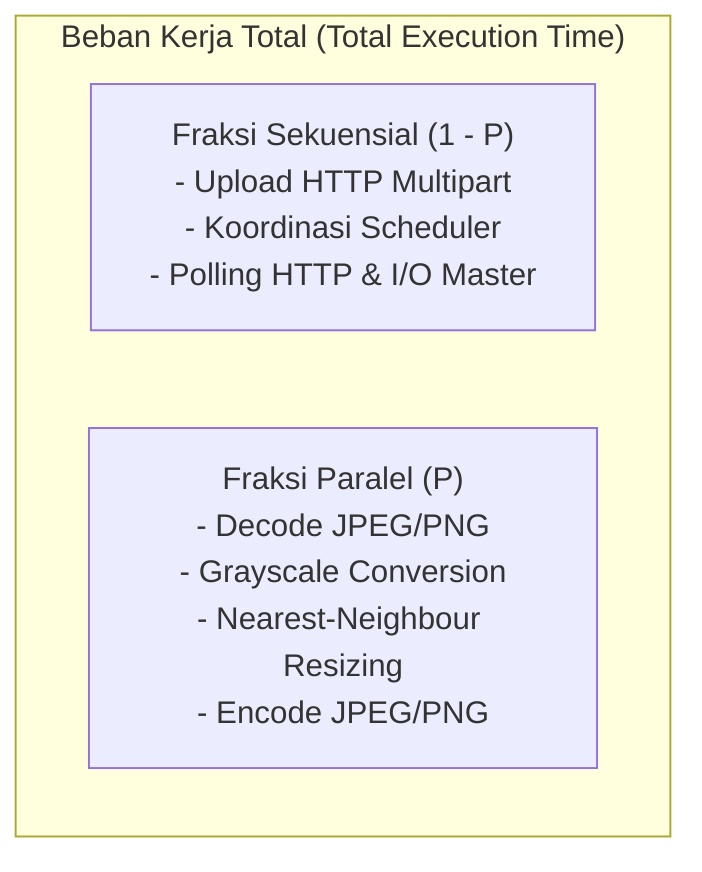
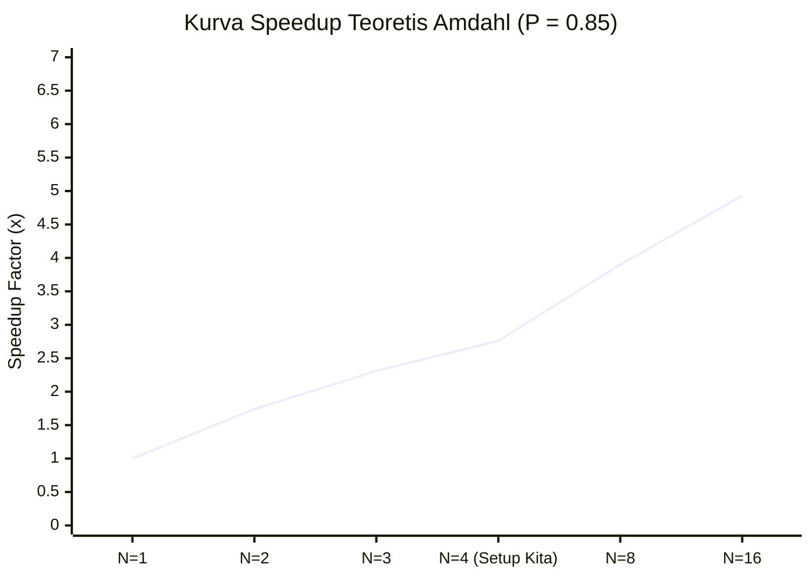
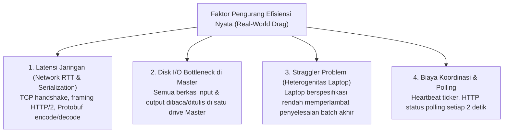

# Analisis Kinerja & Hukum Amdahl — distapi

Dokumen ini mengkaji batasan percepatan (*speedup*) teoretis dan efisiensi pemrosesan paralel pada kluster `distapi` menggunakan landasan **Hukum Amdahl** dan **Hukum Gustafson**.

---

## 1. Landasan Teoretis: Hukum Amdahl

Diformulasikan oleh Gene Amdahl pada tahun 1967, hukum ini menyatakan bahwa peningkatan kecepatan sebuah program yang diparalelkan dibatasi secara mutlak oleh fraksi waktu dari bagian program yang bersifat **sekuensial murni** (tidak dapat diparalelkan).

### Formula Matematika

$$S(N) = \frac{1}{(1 - P) + \frac{P}{N}}$$

Di mana:
* $S(N)$: Percepatan total (*Speedup Factor*) dengan $N$ unit pemroses worker.
* $P$: Fraksi beban kerja yang dapat dieksekusi secara konkuren ($0 \le P \le 1$).
* $(1 - P)$: Fraksi sekuensial murni yang harus dieksekusi satu per satu.
* $N$: Jumlah node pemroses paralel (pada topologi kita: 1 master + 3 worker = hingga 4 unit pemroses).

---

## 2. Batas Asimtotik (Amdahl's Law Asymptote)

Jika jumlah node ditingkatkan tanpa batas ($N \to \infty$):

$$S_{\max} = \lim_{N \to \infty} \frac{1}{(1 - P) + \frac{P}{N}} = \frac{1}{1 - P}$$

*Konsekuensi Arsitektural:* Jika 15% dari siklus pemrosesan gambar dihabiskan untuk upload data melalui jaringan Wi-Fi dan penyimpanan disk di Master ($(1 - P) = 0.15$), maka percepatan maksimum sistem tidak akan pernah melebihi:

$$S_{\max} = \frac{1}{0.15} \approx 6.67\times$$

Meskipun kluster diperbesar menjadi 100 laptop, sistem tidak akan mampu melampaui percepatan $6.67\times$ dari sistem *single-node*.

---

## 3. Matriks Perhitungan Speedup Kluster distapi

Berdasarkan profil aplikasi pengolahan citra digital di mana komputasi transformasi matriks piksel mendominasi beban kerja (estimasi $P = 0.85$):

| Konfigurasi Kluster | Node ($N$) | Speedup Teoretis $S(N)$ | Efisiensi Paralel ($E = S/N$) | Keterangan Operasional |
| :--- | :---: | :---: | :---: | :--- |
| **Hanya Master** | 1 | $1.00\times$ | 100% | *Master-Local Baseline* (tanpa overhead RPC) |
| **Master + 1 Node** | 2 | $1.74\times$ | 87% | Distribusi separuh task ke Laptop 2 |
| **Master + 2 Node** | 3 | $2.31\times$ | 77% | Distribusi task merata ke 3 mesin |
| **Master + 3 Node** | 4 | $2.76\times$ | 69% | **Topologi Penuh Tim (4 Laptop)** |
| *Hipotetis* | 8 | $3.90\times$ | 48% | Terjadi penurunan efisiensi (*Diminishing Returns*) |
| *Teoretis Tak Hingga* | $\infty$ | $6.67\times$ | 0% | Batas mutlak sekuensial ($1 / 0.15$) |

---

## 4. Faktor Penurunan Efisiensi Dunia Nyata (*Real-World Drag Factors*)

Pada implementasi nyata di 4 laptop Windows via LAN/WLAN, nilai speedup aktual akan sedikit berada di bawah batas teoretis Amdahl akibat adanya friksi terdistribusi:

1. **Ukuran Citra vs. RTT Jaringan:**
   * Citra kecil (< 100 KB): Biaya kirim gRPC melebihi waktu pemrosesan piksel. Speedup menjadi rendah ($\le 1.5\times$).
   * Citra besar (2–5 MB): Waktu komputasi piksel mendominasi biaya transmisi data. Speedup mendekati batas teoretis ($2.5\times - 2.7\times$).

---

## 5. Perspektif Hukum Gustafson (Skalabilitas Beban Kerja)

Hukum Amdahl mengasumsikan **beban kerja tetap** (*fixed workload*). Namun, dalam skenario pemrosesan batch nyata, penambahan node ditujukan agar sistem dapat melayani **jumlah gambar yang jauh lebih masif** dalam jendela waktu yang sama (*Scaled Speedup*).

Berdasarkan **Hukum Gustafson-Barsis** (1988):

$$S_{\text{Gustafson}}(N) = N - (1 - P)(N - 1)$$

Dengan $P = 0.85$ dan $N = 4$:

$$S_{\text{Gustafson}}(4) = 4 - (0.15)(3) = 3.55\times$$

*Kesimpulan untuk Laporan Akhir:* Penambahan 3 node worker bukan semata-mata memangkas waktu proses 2 gambar kecil, melainkan meningkatkan kapasitas tampung (*throughput*) kluster dari 5 gambar sekaligus menjadi 20 gambar sekaligus tanpa membebani Master.
