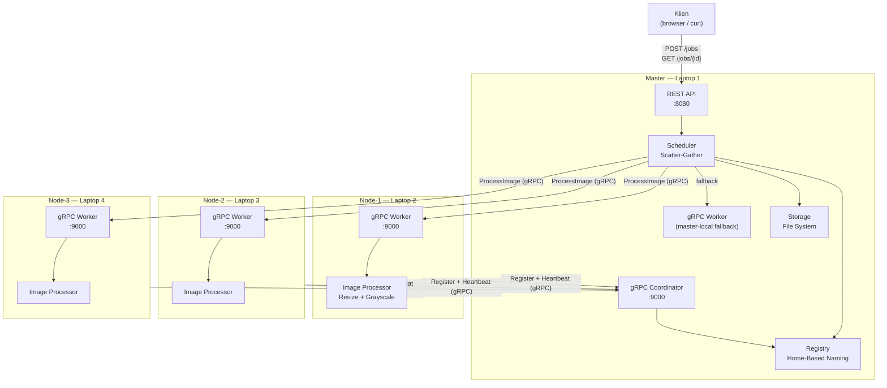
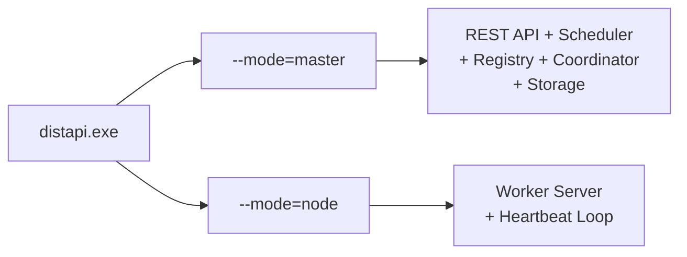
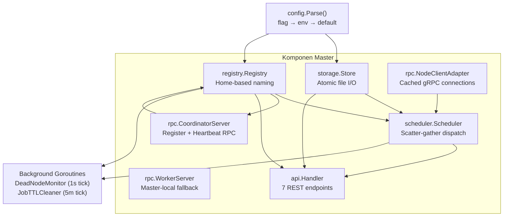
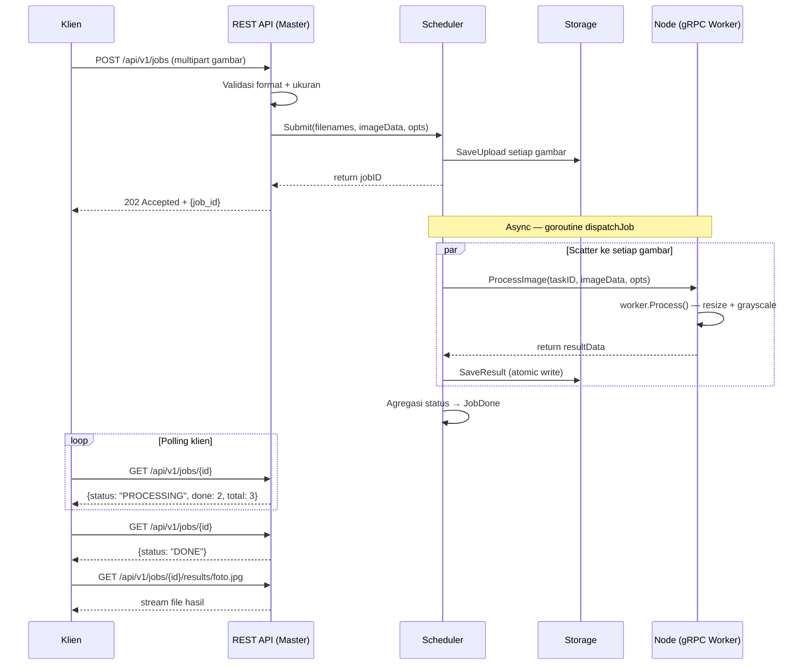
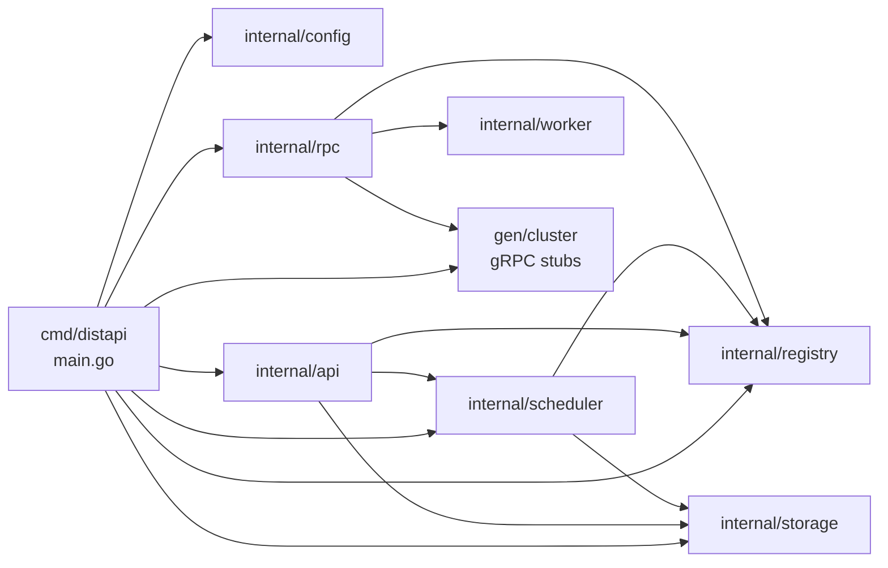

# Arsitektur Sistem — distapi

## 1. Pola Arsitektur: Master-Slave

distapi mengimplementasikan pola **Master-Slave** (DESIGN.md §3). Satu node bertindak sebagai koordinator terpusat (*master*), sisanya sebagai worker (*slave/node*). Pola ini dipilih karena sifat tugas yang **embarrassingly parallel**: setiap gambar dapat diproses secara independen tanpa komunikasi antar node.

## 2. Alasan Pemilihan Master-Slave

| Kriteria | Master-Slave | Peer-to-Peer | Leader Election |
|----------|-------------|--------------|-----------------|
| Kompleksitas implementasi | Rendah ✅ | Tinggi | Tinggi |
| Cocok untuk independent task | Ya ✅ | Ya | Ya |
| SPOF | Ya ⚠️ | Tidak | Tidak |
| Kebutuhan konsensus | Tidak ✅ | Ya | Ya |
| Sesuai scope tugas (4 laptop) | Ya ✅ | Overkill | Overkill |

Untuk demo 4 laptop tanpa DB dan tanpa orchestration platform, Master-Slave adalah pilihan yang paling proporsional.

## 3. Single Binary, Dual Mode

Desain satu binary mempermudah distribusi: cukup copy `distapi.exe` ke semua laptop. Tidak ada dependency runtime tambahan.

## 4. Komponen Master

## 5. Alur Data End-to-End

## 6. Dependency Antar Package

> Tidak ada circular dependency. `scheduler` tidak mengimpor `rpc` — interface `NodeClient` digunakan untuk decoupling.

## 7. Port dan Protokol

| Port | Protokol | Dipakai Oleh | Arah |
|------|----------|-------------|------|
| 8080 | HTTP/1.1 | REST API | Klien → Master |
| 9000 | HTTP/2 (gRPC) | Coordinator | Node → Master |
| 9000 | HTTP/2 (gRPC) | Worker | Master → Node |

> Semua node menggunakan port 9000 yang sama karena setiap laptop punya IP berbeda. Master tahu port node dari nilai `--advertise`.
