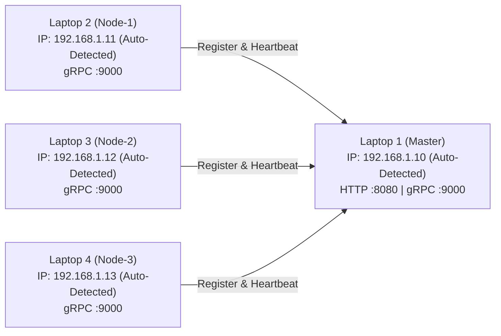

# Panduan Operasional & Penggunaan Windows — distapi

Panduan ini ditujukan bagi operator dan penguji untuk mengompilasi, mendistribusikan, menjalankan, dan mengevaluasi kluster **distapi** secara native pada lingkungan **Windows 10 / 11**.

## 1. Persiapan Awal & Kompilasi Binary

Pastikan kompiler Go versi 1.22 ke atas terpasang pada mesin utama (Laptop 1):

```powershell
# Verifikasi versi Go
go version
```

Kompilasi binary mandiri (*single self-contained executable*):

```powershell
# Jalankan di folder root project C:\Projects\dips-sister
go build -o dist\distapi.exe .\cmd\distapi
```

File `dist\distapi.exe` yang dihasilkan bersifat *stand-alone* (tidak memerlukan runtime Go di laptop node). Cukup salin berkas `distapi.exe` ini via USB Flashdisk atau share folder lokal ke Laptop 2, 3, dan 4.

## 2. Peta Alokasi Host & IP Jaringan (Auto-Detect)

Contoh skenario topologi 4 laptop pada subnet `192.168.1.0/24`:



> **Deteksi IP Otomatis:** Sistem secara otomatis mendeteksi IP fisik Wi-Fi / LAN yang aktif pada tiap laptop (mengabaikan interface loopback dan adapter virtual seperti VMware/WSL/VirtualBox). Pengguna **tidak perlu menjalankan `ipconfig`** secara manual. Master akan langsung menampilkan IP dan perintah worker yang siap disalin ke laptop lain.

## 3. Tingkatan Bantuan & Perintah CLI

Sistem menyediakan 3 tingkatan bantuan untuk kenyamanan operator:

| Perintah | Tingkat Detail | Konten yang Ditampilkan |
|---|---|---|
| `.\distapi.exe` | **Default (Ringkas)** | Hanya menampilkan contoh cepat eksekusi Master dan Worker. |
| `.\distapi.exe -h` | **Inti (Menengah)** | Menampilkan parameter inti (`--mode`, `--token`, `--master`, `--node-id`, `--tui`, `--workers`, ports). |
| `.\distapi.exe --help` | **Lengkap** | Menampilkan seluruh deskripsi arsitektur, parameter failure detector, panduan curl, dan troubleshooting firewall. |

## 4. Urutan Eksekusi Kluster (Execution Sequence)

### Langkah 1: Jalankan Master (Laptop 1)
Buka PowerShell pada Laptop 1 dan jalankan (disarankan menggunakan mode visual TUI):

```powershell
.\dist\distapi.exe --mode=master --token=demo123 --tui
```

*Terminal Master akan langsung menampilkan antarmuka visual Bubble Tea berisi:*
- Alamat IP Master yang terdeteksi.
- URL Web UI (`http://<IP>:8080`).
- Port gRPC kluster (`:9000`).
- Perintah PowerShell siap salin untuk Laptop 2, 3, dan 4.

*(Opsional: Jika ingin mode CLI teks standar tanpa TUI, cukup hilangkan flag `--tui`)*.

### Langkah 2: Jalankan Node Worker (Laptop 2, 3, 4)

Seluruh laptop worker dapat menjalankan **perintah yang sama persis** tanpa perlu menentukan `--node-id` secara manual. Master akan mengalokasikan nomor node (`node-1`, `node-2`, `node-3`) secara otomatis berdasarkan urutan kedatangan:

```powershell
.\distapi.exe --mode=node --master=192.168.1.10:9000 --token=demo123 --tui
```

*Begitu terhubung ke Master:*
- **Laptop 2** otomatis dialokasikan sebagai `node-1` (tampil di header TUI & log).
- **Laptop 3** otomatis dialokasikan sebagai `node-2` (tampil di header TUI & log).
- **Laptop 4** otomatis dialokasikan sebagai `node-3` (tampil di header TUI & log).

*(Catatan: Operator tetap dapat menentukan ID secara eksplisit jika diinginkan, misal `--node-id=node-khusus`)*.

> **Perlindungan Tabrakan Identitas (Node ID Collision Guard):**
> Jika ada worker lain memaksa mendaftar manual menggunakan ID yang sedang aktif digunakan laptop lain, Master akan menolak pendaftaran tersebut secara tegas (`Accepted: false`) untuk mencegah *session hijacking* dan *flapping*. Jika sebuah node mengalami restart pada laptop yang sama, Master langsung menerimanya kembali dengan ID yang sama (*sticky assignment*).

## 5. Validasi Topologi Kluster

Setelah seluruh node dijalankan, periksa pendaftaran node dari terminal Laptop 1 atau browser:

```powershell
curl.exe http://localhost:8080/api/v1/nodes
```

Pastikan output menampilkan ketiga node dengan status `"alive"`:
```json
[
  {"node_id":"node-1","status":"alive","addr":"192.168.1.11:9000", ...},
  {"node_id":"node-2","status":"alive","addr":"192.168.1.12:9000", ...},
  {"node_id":"node-3","status":"alive","addr":"192.168.1.13:9000", ...}
]
```

## 6. Pengujian Alur Pemrosesan Batch (Workflow Test)

### A. Kirim Batch Gambar (Scatter Phase)
Jalankan pengiriman batch gambar melalui `curl.exe` bawaan Windows:

```powershell
curl.exe -X POST http://192.168.1.10:8080/api/v1/jobs `
  -F "images=@C:\demo\img1.jpg" `
  -F "images=@C:\demo\img2.jpg" `
  -F "images=@C:\demo\img3.jpg" `
  -F "images=@C:\demo\img4.jpg" `
  -F 'options={"grayscale":true,"resize_width":800,"resize_height":800}'
```

Output:
```json
{"job_id":"job_64fa10b93d8e012a","status":"PENDING","tasks":4}
```

### B. Pantau Progres Task Real-time (Polling)
```powershell
$jobId = "job_64fa10b93d8e012a"
curl.exe "http://192.168.1.10:8080/api/v1/jobs/$jobId"
```

Perhatikan field `assigned_to` pada setiap task. Task akan tersebar merata ke `node-1`, `node-2`, dan `node-3` secara bergantian (*Round-Robin*).

### C. Unduh Hasil Olahan (Gather Phase)
```powershell
Invoke-WebRequest `
  -Uri "http://192.168.1.10:8080/api/v1/jobs/$jobId/results/img1.jpg" `
  -OutFile "C:\demo\hasil_img1.jpg"
```

## 7. Skenario Uji Ketahanan (Fault Tolerance Demo)

Untuk menunjukkan keandalan sistem di depan dosen/penguji:

1. **Jalankan job dengan 12 gambar** sehingga antrian pemrosesan berjalan di semua node.
2. **Matikan paksa Laptop 3 (Node 2)** dengan menekan `Ctrl + C` pada terminalnya.
3. Amati log pada Master:
   - Setelah 6 detik, Master mendeteksi: `level=WARN msg="node mati terdeteksi, task dijadwalkan ulang" node_ids=["node-2"]`.
   - Task yang sebelumnya sedang berjalan di `node-2` otomatis dialihkan ke `node-1` atau `node-3`.
   - Seluruh job tetap mencapai status akhir `DONE` tanpa ada gambar yang hilang atau korup.
