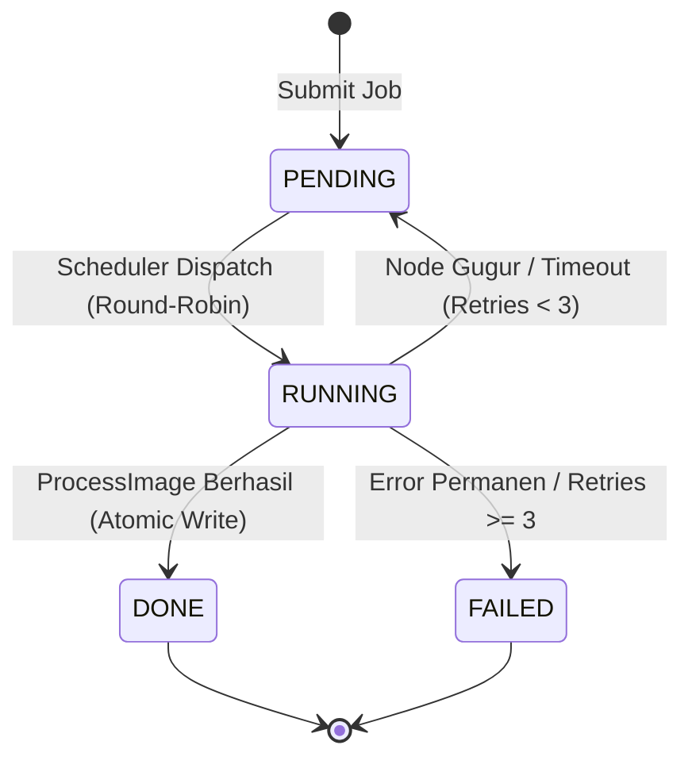
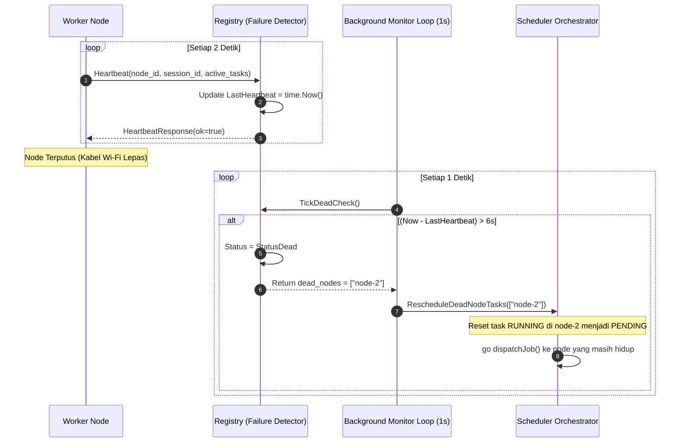
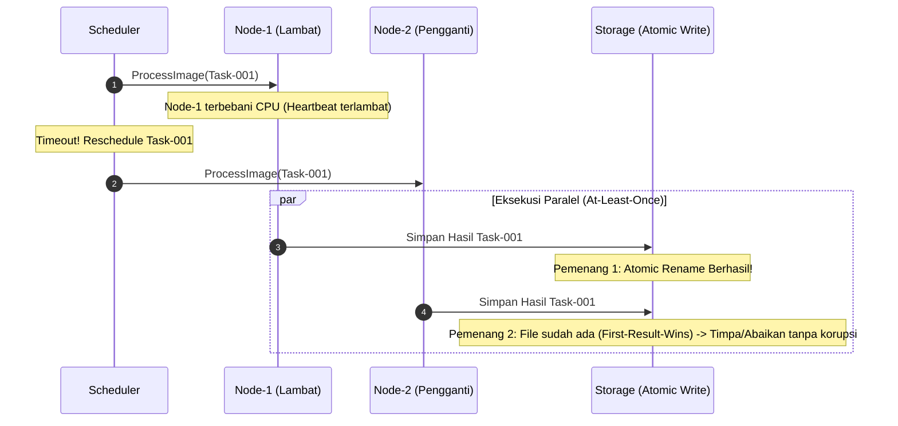
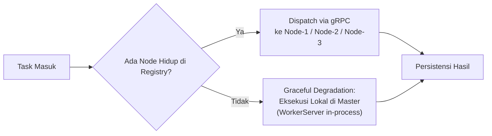

# Toleransi Kesalahan (Fault Tolerance) — distapi

Toleransi kesalahan (*Fault Tolerance*) adalah karakteristik arsitektur yang memungkinkan sistem terdistribusi tetap beroperasi secara konsisten dan benar meskipun terjadi kegagalan parsial (*partial failure*) pada satu atau beberapa komponen pembangunnya.

Dokumen ini menguraikan model kegagalan, arsitektur pendeteksian kegagalan (*failure detector*), semantik eksekusi RPC, dan strategi mitigasi konkurensi pada `distapi`.

---

## 1. Model Kegagalan (Failure Model)

Berdasarkan klasifikasi kegagalan terdistribusi (Cristian, 1991):

| Tipe Kegagalan | Definisi Teoretis | Manifestasi pada distapi | Penanganan Arsitektural |
| :--- | :--- | :--- | :--- |
| **Crash-Stop** | Node berhenti beroperasi permanen tanpa mengirim sinyal | Laptop mati total, baterai habis, proses di-*kill* | Heartbeat failure detector mendeteksi ketiadaan sinyal dalam 6 detik; alihkan task ke node lain |
| **Crash-Recovery** | Node berhenti sementara, kemudian bergabung kembali | Laptop restart, adapter Wi-Fi reconnect | Generasi `SessionID` baru mendeteksi pemulihan node; node kembali masuk antrian scheduler |
| **Omission Fault** | Pesan jaringan hilang atau di-drop buffer | Latensi paket tinggi pada Wi-Fi lokal | Batas waktu `task-timeout` (30s); mekanisme *automatic retry* hingga 3 kali |
| **Crash Master (SPOF)** | Node koordinator tunggal mengalami kegagalan total | Laptop Master mati | Diakui sebagai *Single Point of Failure* dalam batasan desain tugas; state hilang karena disimpan *in-memory* |

---

## 2. Finite State Machine (FSM) Task

Setiap gambar yang dikirim oleh klien dievaluasi melalui mesin status transisi searah (*Forward-Only State Machine*):

### Aturan Transisi Status
1. **PENDING → RUNNING:** Task diambil oleh goroutine scheduler, ditugaskan ke sebuah `node_id`, dan dipanggil melalui antarmuka gRPC `ProcessImage`.
2. **RUNNING → DONE:** Node worker mengembalikan payload hasil olahan gambar, dan Master berhasil melakukan operasi *atomic rename* pada sistem berkas lokal.
3. **RUNNING → PENDING (Reschedule):** Terjadi jika koneksi jaringan putus, batas waktu 30 detik habis, atau heartbeat detector mengumumkan node pengemban task telah gugur (`StatusDead`). Counter `Retries` bertambah +1.
4. **RUNNING → FAILED:** Ambang `max-retries` (default: 3) terlampaui. Task ditandai gagal permanen dan status Job agregat berubah menjadi `FAILED`.

---

## 3. Algoritma Failure Detector Berbasis Heartbeat

`distapi` mengimplementasikan pendeteksi kegagalan tipe **Unreliable Failure Detector with Periodic Ping** ($\mathcal{P}$-type):

### Rasio Batas Waktu $\Delta t$
* **Heartbeat Interval ($T_h$):** 2 detik.
* **Node Timeout ($T_{timeout}$):** 6 detik ($3 \times T_h$).
* **Rasionalitas:** Rasio $3:1$ memberikan toleransi terhadap $2$ kali paket heartbeat yang hilang (*transient network jitter*) sebelum Master mengambil keputusan drastis untuk mengeksekusi *failover* tugas.

---

## 4. Semantik Eksekusi: At-Least-Once & First-Result-Wins

Pada sistem terdistribusi, komunikasi jaringan dapat menyebabkan skenario *slow node* (node masih bekerja namun Master menganggapnya mati karena heartbeat terlambat).

### Prinsip Idempotensi & Atomic Write
1. **Idempotensi Fungsi Pekerja:** Transformasi citra grayscale dan resizing pada `internal/worker` bersifat deterministik murni. Diberikan citra $I$ dan opsi $O$, output $f(I, O)$ selalu identik tanpa *side-effect*.
2. **First-Result-Wins:** Master memeriksa `storage.ResultExists()` dan memanfaatkan jaminan atomisitas `os.Rename` pada sistem berkas NTFS. Tidak ada kondisi di mana berkas hasil olahan terpotong atau korup akibat balapan (*race condition*) dua node worker.

---

## 5. Degradasi Anggun (Graceful Degradation: Master-Local Processing)

Ketika seluruh laptop Node worker (Laptop 2, 3, 4) mati atau terputus secara bersamaan:

1. Scheduler mendeteksi `len(registry.AliveNodes()) == 0`.
2. Target node secara otomatis disetel ke entitas semu `"master-local"`.
3. `NodeClientAdapter` mengeksekusi transformasi citra secara *in-process* menggunakan alokasi CPU cadangan Master (`runtime.NumCPU() / 2`).
4. **Hasil:** Sistem tetap melayani permintaan klien (ketersediaan tetap terjaga), meskipun dengan penurunan throughput (*Degraded Performance*).
