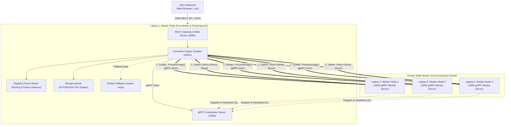
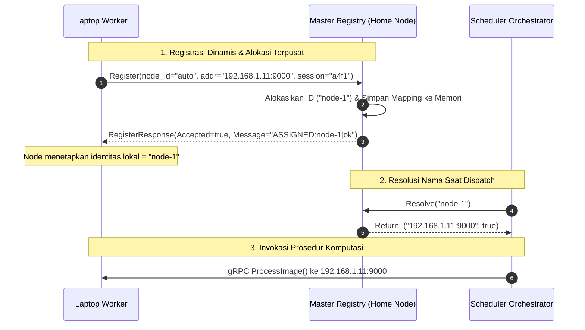
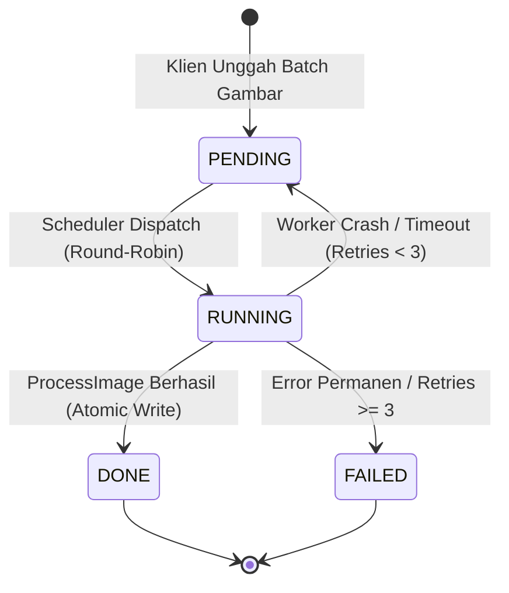
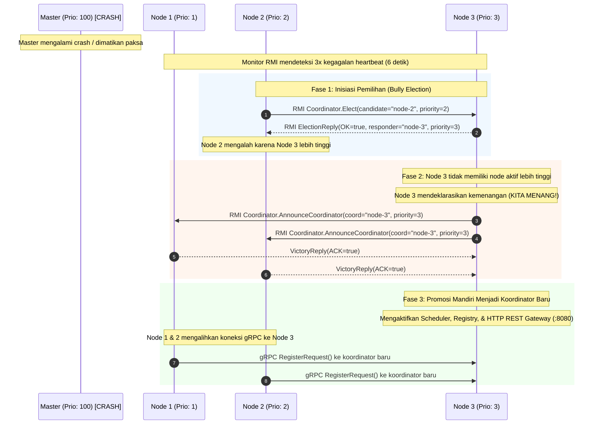
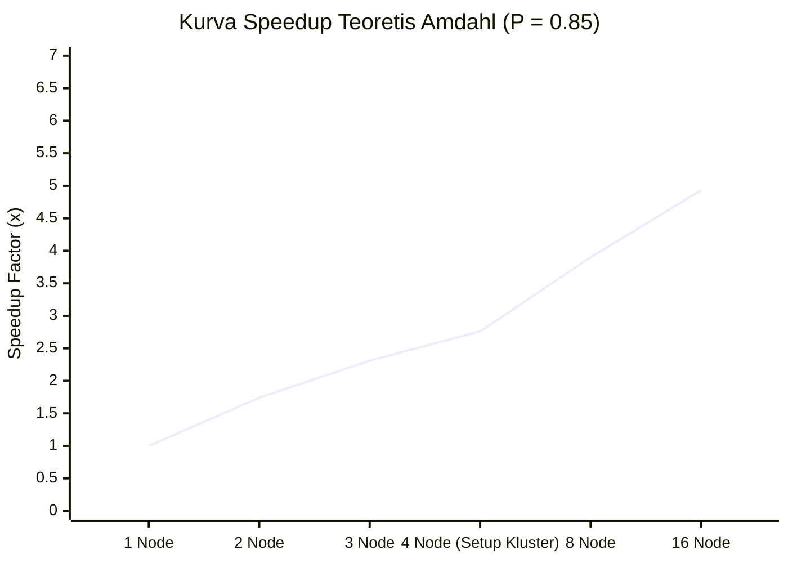
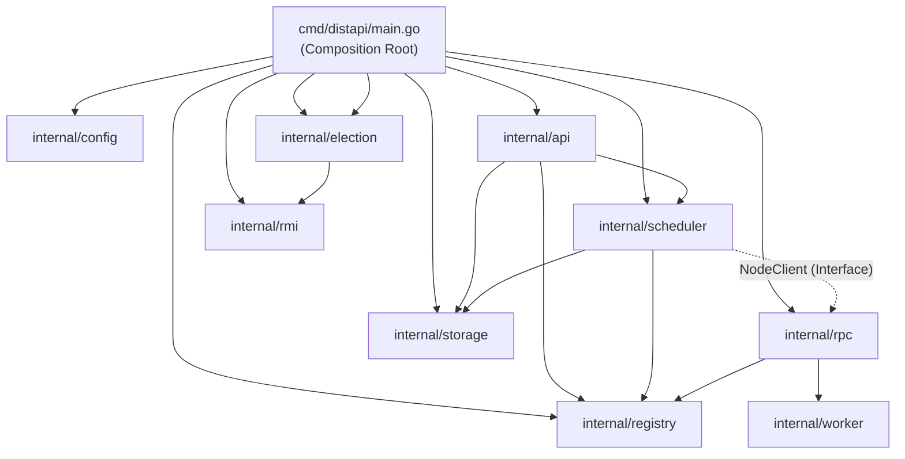

# Laporan Rekayasa & Teori Sistem Terdistribusi — distapi

> **Mata Kuliah:** Sistem Terdistribusi (IF2228)  
> **Dosen Pengampu:** Yoga Dwitya P., M.Cs.  
> **Program Studi:** Teknik Informatika, Universitas Trunojoyo Madura  
> **Dokumen Terpadu:** Arsitektur Sistem, Komunikasi RPC, Penamaan, Toleransi Kesalahan, Analisis Kinerja, & Struktur Kode

---

## 1. Pemetaan Silabus Kuliah ke Implementasi Sistem

Tabel berikut memetakan langsung teori pada slide perkuliahan Sistem Terdistribusi dengan implementasi konkret pada kode sumber `distapi`:

| Modul Slide | Topik Kunci Kuliah | Implementasi Nyata di distapi | Rujukan Kode |
|---|---|---|---|
| **01: Pengantar** | *Horizontal Scaling*, *Message Passing*, Ketiadaan Memori Bersama (*No Common Physical Memory*). | Kluster 4 laptop fisik independen dihubungkan via Wi-Fi/LAN. Data citra dikirim sebagai byte stream via socket jaringan (tanpa folder share SMB/NFS). | [`cmd/distapi/main.go`](file:///home/mfjrxn/Downloads/UTM/SISTER/dips-sister/cmd/distapi/main.go) |
| **02: Networking** | Socket TCP vs UDP, *In-Order Delivery*, *Reliability*, dan *Flow Control*. | Menggunakan protokol TCP untuk seluruh komunikasi (HTTP/1.1 REST, HTTP/2 gRPC, dan TCP net/rpc RMI). | [`internal/rpc/rpc.go`](file:///home/mfjrxn/Downloads/UTM/SISTER/dips-sister/internal/rpc/rpc.go)<br>[`internal/rmi/server.go`](file:///home/mfjrxn/Downloads/UTM/SISTER/dips-sister/internal/rmi/server.go) |
| **03: RPC & Semantics** | *Remote Invocation*, Client/Server Stubs, Marshalling biner, *Crash/Omission Failure*, Idempotensi, Semantik *At-Least-Once*. | Kontrak Protocol Buffers v3 (`cluster.proto`), transmisi biner gRPC. Transformasi gambar bersifat idempoten; Master menerapkan timeout 30s dan percobaan ulang otomatis $\le 3$ kali (*At-Least-Once*). | [`proto/cluster.proto`](file:///home/mfjrxn/Downloads/UTM/SISTER/dips-sister/proto/cluster.proto)<br>[`internal/worker/worker.go`](file:///home/mfjrxn/Downloads/UTM/SISTER/dips-sister/internal/worker/worker.go) |
| **03: RMI (Remote Method Invocation)** | Pemanggilan metode pada *Remote Object*, pemisahan *Remote Interface* dan *Skeleton/Dispatcher*, eksekusi objek terdistribusi. | Implementasi Remote Object `CoordinatorService` dan `ImageProcessorService` berbasis Go `net/rpc` dengan port 9050. Mendukung pemanggilan metode objek transformasi citra jarak jauh dan inspeksi kesehatan via CLI `distapi rmi-test`. | [`internal/rmi/coordinator_service.go`](file:///home/mfjrxn/Downloads/UTM/SISTER/dips-sister/internal/rmi/coordinator_service.go)<br>[`internal/rmi/processor_service.go`](file:///home/mfjrxn/Downloads/UTM/SISTER/dips-sister/internal/rmi/processor_service.go) |
| **04: Arsitektur** | Pola *Master-Slave*, peran asimetris, *Tiering* (3-Tier), dan *Layering*. | Master bertindak sebagai orchestrator tunggal (*Scatter-Gather* & Storage). Slave bertindak sebagai worker komputasi murni. Struktur 3-tier: Web/TUI (Presentation), Scheduler/Worker (Logic), Storage Atomik (Data). | [`internal/scheduler/scheduler.go`](file:///home/mfjrxn/Downloads/UTM/SISTER/dips-sister/internal/scheduler/scheduler.go)<br>[`internal/storage/storage.go`](file:///home/mfjrxn/Downloads/UTM/SISTER/dips-sister/internal/storage/storage.go) |
| **05: Penamaan** | *Flat Naming*, Resolusi Alamat, *Home-Based Approach* untuk entitas yang berpindah lokasi fisik (DHCP). | Master bertindak sebagai **Home Node**. Node worker memiliki identifier datar (`node-1`, `node-2`) dengan alokasi otomatis oleh Master. Worker melaporkan alamat IP fisiknya saat mendaftar atau berpindah IP. | [`internal/registry/registry.go`](file:///home/mfjrxn/Downloads/UTM/SISTER/dips-sister/internal/registry/registry.go) |
| **06: RESTful API** | Kewajiban antarmuka RESTful API (metode HTTP baku, representasi resource JSON). | 8 endpoint standar berbasis amplop JSON, unggah multipart citra, respons asinkron `202 Accepted`, dan streaming biner hasil. | [`internal/api/api.go`](file:///home/mfjrxn/Downloads/UTM/SISTER/dips-sister/internal/api/api.go) |
| **Sinkronisasi & Pemilihan** | Penentuan node koordinator, Algoritma Pemilihan Bully (*Bully Algorithm*, Garcia-Molina 1982), *Dynamic Coordinator Failover*. | Penentuan koordinator berbasis bobot prioritas. Jika koordinator mati, detektor kegagalan berkala memicu pemilihan otomatis: node aktif berprioritas tertinggi menang, mendeklarasikan *Victory* via RMI, dan mempromosikan diri menjadi koordinator baru secara mulus. | [`internal/election/election.go`](file:///home/mfjrxn/Downloads/UTM/SISTER/dips-sister/internal/election/election.go) |

---

## 2. Arsitektur Sistem (Master-Slave Pattern)

Sistem dirancang menggunakan arsitektur **Master-Slave** asimetris karena domain pengolahan citra digital bersifat *embarrassingly parallel*: setiap berkas gambar dapat didekode, diubah skalanya (*resize*), dan dikonversi ke grayscale secara independen tanpa memerlukan sinkronisasi data antar node worker.



### Konsep Single Binary, Dual Mode
Seluruh komponen Master, Worker, dan aset Web UI dikompilasi menjadi sebuah berkas biner tunggal (`distapi.exe`):
* Mode Master (`--mode=master`): Mengaktifkan REST API Gateway, Web UI, Scheduler Scatter-Gather, Registry Kluster, dan Penyimpanan Atomik.
* Mode Node (`--mode=node`): Mengaktifkan Worker Server gRPC dan loop Heartbeat ke Master.

---

## 3. Komunikasi Antar-Node: RPC & gRPC

Untuk komunikasi antar-laptop, sistem memilih **gRPC di atas HTTP/2** daripada REST/JSON internal dengan pertimbangan efisiensi transmisi data citra:

| Karakteristik | REST + JSON (Internal) | gRPC + Protocol Buffers v3 |
|---|---|---|
| **Encoding Citra Biner** | Wajib Base64 (ukuran membengkak $+33\%$) | Biner murni langsung (`bytes` field) |
| **Transport Protocol** | HTTP/1.1 teks, koneksi buka-tutup | HTTP/2 biner multiplexing, header compression |
| **Kontrak Antarmuka** | Dokumentasi manual, rentan beda tipe data | IDL terkompilasi baku (`cluster.proto`), type-safe |
| **Beban Jaringan per 5 MB Gambar** | Membutuhkan $\approx 6.6\text{ MB}$ transfer | Tepat $5.0\text{ MB}$ transfer |

### Kontrak Protocol Buffers (`proto/cluster.proto`)
Komunikasi kluster mendefinisikan dua service dengan arah pemanggilan asimetris:
```protobuf
syntax = "proto3";
package cluster;

// Berjalan di Master, dipanggil oleh Node Worker (Arah: Worker -> Master)
service Coordinator {
  rpc Register(RegisterRequest)   returns (RegisterResponse);
  rpc Heartbeat(HeartbeatRequest) returns (HeartbeatResponse);
}

// Berjalan di setiap Node Worker, dipanggil oleh Master (Arah: Master -> Worker)
service Worker {
  rpc ProcessImage(ProcessRequest) returns (ProcessResponse);
}
```

### Autentikasi Interceptor Token
Keamanan transmisi antar-laptop dilindungi oleh *shared token* via gRPC Unary Interceptor (`x-cluster-token`). Nilai bawaan (*default*) adalah `"demo123"`, sehingga seluruh laptop dapat langsung berkomunikasi tanpa konfigurasi token yang rumit saat demo.

### 3.1 Remote Method Invocation (RMI) & Perbandingan Tiga Paradigma Komunikasi

Sesuai materi slide perkuliahan *03_RPC* (halaman *Remote Invocation*), sistem terdistribusi membedakan dua jenis *remote invocation*:
1. **Remote Procedure Calls (RPC):** Pemanggilan fungsi/prosedur gaya imperatif tradisional pada mesin remote tanpa pemindahan state objek.
2. **Remote Method Invocation (RMI):** Pemanggilan method pada *Remote Object* berbasis paradigma berorientasi objek (*Object-Oriented Programming*). Pada RMI, pemanggil memegang referensi ke objek jarak jauh (*Remote Reference*) dan memanggil method yang mengubah atau membaca state objek tersebut.

Pada `distapi`, ketiga paradigma komunikasi utama dalam silabus perkuliahan diimplementasikan secara komplementer sesuai kebutuhan:

| Karakteristik | RESTful API (HTTP/JSON) | RPC (gRPC / Protobuf v3) | RMI (`net/rpc` Remote Object) |
|---|---|---|---|
| **Rujukan Silabus** | Modul 06: Restful API | Modul 03: Remote Procedure Calls | Modul 03: Remote Method Invocation |
| **Model Abstraksi** | Resource-Oriented (URI, GET/POST/DELETE) | Service-Oriented (Procedure Call via IDL) | Object-Oriented (Method Invocation on Remote Object) |
| **Format Serialisasi** | Teks JSON (Universal, mudah dibaca manusia) | Biner Protocol Buffers v3 (Sangat padat & efisien) | Biner Go Gob / Native (Kompak, preservasi tipe data) |
| **Protokol Transport** | HTTP/1.1 (TCP port 8080) | HTTP/2 multiplexing (TCP port 9000) | TCP Socket murni (TCP port 9050) |
| **Peran Konkret di Sistem** | Antarmuka klien eksternal (Browser, Web UI, `curl`) | Distribusi paralel data citra (*Scatter-Gather* skala besar) | Sinkronisasi kluster, pertukaran peer, dan pemilihan koordinator |
| **Contoh Pemanggilan** | `POST /api/v1/jobs` (Upload multipart) | `Worker.ProcessImage(ProcessRequest)` | `Coordinator.Elect(args)` & `ImageProcessor.TransformImage(args)` |

#### Komponen Arsitektur RMI di distapi
* **Remote Object (`CoordinatorService`):** Mengelola state kepemimpinan kluster, pertukaran sinyal detak jantung, serta pemrosesan pesan pemilihan koordinator (`Elect`, `AnnounceCoordinator`, `Heartbeat`, `Ping`).
* **Remote Object (`ImageProcessorService`):** Mengeksekusi transformasi citra (aspect resize dan grayscale) secara langsung sebagai pemanggilan method objek jarak jauh.
* **Skeleton / Dispatcher (`rmi.Server`):** Listener TCP berbasis Go standard library `net/rpc` yang mendemultipleks pemanggilan metode klien ke instance objek yang sesuai.
* **Client Proxy (`rmi.Client`):** Abstraksi transparan yang membungkus koneksi socket, serialisasi parameter argumen, batas waktu (*timeout*), dan deserialisasi hasil balasan.
* **Alat Uji Mandiri CLI:** Perintah `distapi rmi-test [target]` memungkinkan asisten lab atau dosen memverifikasi fungsionalitas RMI secara instan dari konsol terminal.

---

## 4. Layanan Penamaan: Home-Based Naming

Sesuai literatur sistem terdistribusi (Tanenbaum & Van Steen), sistem penamaan bertanggung jawab memetakan nama logis entitas ke alamat fisik jaringan.

* **Home Node:** Master (Laptop 1) bertindak sebagai *Home Location Register* permanen.
* **Identifier Datar (Flat Name):** `NodeID` string atomik tanpa hierarki direktori (contoh: `"node-1"`). Resolusi alamat berlangsung instan $O(1)$ di memori Master.
* **Alamat Fisik (Foreign Address):** `AdvertiseAddr` (contoh: `"192.168.1.11:9000"`).



### Alokasi Otomatis Identitas Node (Dynamic Auto-Assignment)
Untuk mengeliminasi beban konfigurasi manual saat menguji 4 laptop:
1. Operator di Laptop 2, 3, dan 4 tidak perlu mengetikkan flag `--node-id` (otomatis `"auto"`).
2. **Sticky Assignment:** Master mencatat alamat IP setiap node. Jika sebuah laptop mengalami restart, Master otomatis memberikan kembali nomor ID yang sama.
3. **Sequential Pool:** Jika alamat baru bergabung, Master mengalokasikan nomor urut terkecil yang tersedia (`node-1`, `node-2`, `node-3`, dst).
4. Layar terminal TUI maupun log konsol di laptop worker langsung menampilkan nomor node yang diperoleh secara real-time.

---

## 5. Toleransi Kesalahan: Failure Detector & Recovery

Sistem mengantisipasi model kegagalan asinkron berbasis klasifikasi Cristian (1991):



### Algoritma Detektor Kegagalan Heartbeat ($\mathcal{P}$-type)
* **Interval Heartbeat ($T_h$):** Worker mengirimkan sinyal detak jantung setiap **2 detik**.
* **Batas Waktu Timeout ($T_{timeout}$):** Master menetapkan batas **6 detik** ($3 \times T_h$).
* **Pemulihan Transien:** Rasio $3:1$ memberikan toleransi terhadap 2 kali paket hilang akibat *network jitter* pada Wi-Fi lokal sebelum Master menyatakan node mati (*dead*).
* **Automatic Rescheduling:** Jika node mati saat sedang memproses task, Master segera mereset status task tersebut menjadi `PENDING` dan menjadwalkan ulang ke worker lain yang masih sehat.

### Semantik Eksekusi: At-Least-Once & First-Result-Wins
Jika terjadi kondisi *slow node* (laptop worker lambat merespons sehingga dianggap mati padahal masih memproses), Master akan mendistribusikan ulang task yang sama ke worker lain:
* Transformasi citra bersifat murni dan idempoten (tanpa *side-effect*).
* Penyimpanan Master menggunakan **Atomic Write** (`temp-file -> rename`). Hasil pertama yang berhasil disimpan akan langsung mengunci status task menjadi `DONE` (*First-Result-Wins*), sementara hasil yang datang terlambat diabaikan dengan aman tanpa memicu korupsi data.

---

## 6. Sinkronisasi & Pemilihan Koordinator: Algoritma Bully & Failover Dinamis

Dalam arsitektur terdistribusi Master-Slave konvensional, node Master menjadi *Single Point of Failure* (SPOF): jika Master mati atau mengalami crash, seluruh sistem akan lumpuh. Untuk mengatasi kelemahan mendasar ini, `distapi` dilengkapi dengan **mekanisme sinkronisasi dan pemilihan koordinator otomatis** berbasis **Algoritma Bully** (*Bully Algorithm*, Garcia-Molina, 1982).

### 6.1 Penentuan Node Koordinator

Setiap node dalam kluster memiliki nilai bobot prioritas numerik ($P \in \mathbb{N}$):
* **Master Awal (Laptop 1):** Ditetapkan secara default memiliki bobot prioritas tertinggi ($P = 100$).
* **Node Worker (Laptop 2, 3, 4):** Memperoleh prioritas secara deterministik melalui ekstraksi angka ID node (`node-1` $\to 1$, `node-2` $\to 2$, `node-3` $\to 3$), atau diatur secara eksplisit oleh operator melalui flag CLI `--priority=<angka>`.
* **Aturan Kepemimpinan:** Node aktif dengan nilai prioritas tertinggi berhak menjadi **Koordinator Kluster**.

### 6.2 Deteksi Kegagalan Koordinator (Failure Detector)

Setiap node worker menjalankan pemantau latar belakang (`election.Engine.StartMonitor`):
1. Worker mengirimkan sinyal detak jantung berkala via RMI (`Coordinator.Heartbeat`) setiap 2 detik ke koordinator aktif.
2. Respons detak jantung memuat topologi seluruh peer terkini di kluster, sehingga setiap node selalu memiliki peta alamat node lain secara terdesentralisasi.
3. Jika koordinator gagal merespons sebanyak **3 kali berturut-turut** (total durasi 6 detik), detektor kegagalan menyatakan koordinator aktif **MATI / DEAD** dan secara otomatis memicu proses pemilihan koordinator baru (*Election*).

### 6.3 Alur Algoritma Bully (Garcia-Molina, 1982)

Ketika sebuah node $P_i$ mendeteksi hilangnya koordinator:
1. **Mengirim Pesan ELECTION:** Node $P_i$ mengirimkan pesan RMI `Coordinator.Elect` ke seluruh node lain yang memiliki bobot prioritas lebih tinggi ($P_j > P_i$).
2. **Respon Node Lebih Tinggi:** Jika ada node $P_j$ yang masih hidup, node tersebut merespons dengan `OK` dan mengambil alih inisiasi pemilihan untuk mengalahkan node-node di bawahnya.
3. **Deklarasi Kemenangan (VICTORY):** Jika dalam batas waktu *timeout* (2 detik) tidak ada node berprioritas lebih tinggi yang menjawab, atau jika node $P_i$ memang merupakan node aktif berprioritas tertinggi, maka node $P_i$ memenangkan pemilihan dan menyiarkan pesan `Coordinator.AnnounceCoordinator` (*VICTORY*) ke seluruh node aktif di kluster.



### 6.4 Transisi Failover Koordinator Tanpa Restart Biner

Kunci keandalan produksi (*production-grade*) sistem `distapi` adalah kemampuan berpindah peran secara dinamis tanpa perlu me-restart proses biner:
* **Pre-registered Dual gRPC Services:** Pada saat inisialisasi awal, seluruh node worker telah mendaftarkan kedua kontrak gRPC (`cluster.RegisterWorkerServer` dan `cluster.RegisterCoordinatorServer`) ke listener gRPC-nya. Dengan demikian, ketika node worker dipromosikan menjadi koordinator, gRPC server miliknya sudah siap menerima registrasi dari worker lain tanpa restart port.
* **Aktivasi Scheduler & REST API Otomatis:** Saat callback `onPromoted` dipicu, node baru menginisialisasi engine `scheduler.Scheduler`, menghubungkan penyimpanan berkas atomik, dan menjalankan HTTP REST Gateway di port 8080.
* **Pengalihan Klien Kueri & Worker:** Node-node lain yang menerima pesan kemenangan mengeksekusi callback `onCoordinatorChanged`, memutuskan koneksi gRPC lama, membuka koneksi gRPC baru ke koordinator terpilih, dan mendaftar ulang secara otomatis (*dynamic re-registration*).

---

## 7. Analisis Kinerja Komputasi: Hukum Amdahl

Peningkatan kecepatan (*speedup*) komputasi paralel dibatasi secara fundamental oleh Hukum Amdahl (1967):

$$S(N) = \frac{1}{(1 - P) + \frac{P}{N}}$$

Di mana:
* $S(N)$: Percepatan total (*Speedup Factor*) dengan $N$ unit pemroses worker.
* $P$: Fraksi beban kerja yang dapat dieksekusi secara konkuren ($0 \le P \le 1$).
* $(1 - P)$: Fraksi sekuensial murni (I/O disk Master, parsing multipart, upload HTTP, dan koordinasi jaringan).
* $N$: Jumlah node komputasi paralel ($N = 4$ laptop pada konfigurasi penuh kita).



### Proyeksi Percepatan Kluster 4 Laptop
Dengan estimasi fraksi transformasi matriks piksel $P = 0.85$ dan overhead I/O sekuensial $(1 - P) = 0.15$:
* **1 Laptop (Master-Local):** $S(1) = 1.00\times$ (Baseline).
* **2 Laptop (Master + 1 Worker):** $S(2) = 1.74\times$ (Efisiensi 87%).
* **3 Laptop (Master + 2 Worker):** $S(3) = 2.31\times$ (Efisiensi 77%).
* **4 Laptop (Master + 3 Worker):** $S(4) = 2.76\times$ (Efisiensi 69%).
* **Batas Asimtotik ($N \to \infty$):** $S_{\max} = \frac{1}{1 - 0.85} = 6.67\times$.

---

## 8. Struktur Kode Sumber & Clean Architecture

Kode sumber diatur mengikuti *Standard Go Project Layout* dengan pemisahan tanggung jawab yang ketat:

```text
distapi/
  cmd/
    distapi/main.go         # Composition Root, evaluasi flag, & graceful shutdown
    genimages/main.go       # Utility generator gambar sintetis untuk pengujian beban
  proto/cluster.proto       # Kontrak formal interface IDL Protocol Buffers v3
  gen/cluster/              # Kode stub gRPC & struct Protobuf hasil kompilasi
  internal/                 # Domain internal terlindungi (Clean Architecture)
    config/                 # Evaluasi konfigurasi 12-factor (Flag > Env > Default)
    storage/                # Abstraksi persistensi atomik (Write to Temp + Atomic Rename)
    registry/               # Home-Based Naming Service & Heartbeat Failure Detector
    worker/                 # Logika transformasi citra stateless (Aspect Resize & BT.601)
    scheduler/              # Engine orkestrasi Scatter-Gather & Round-Robin Dispatcher
    rpc/                    # Server/Client gRPC & Interceptor Token Metadata
    rmi/                    # Remote Method Invocation (net/rpc), remote objects & types
    election/               # Engine pemilihan koordinator (Bully Algorithm) & Failover
    api/                    # RESTful API Gateway (Go 1.22+ Standard Mux)
    tui/                    # Antarmuka visual Terminal UI (Bubble Tea & Lip Gloss)
  web/                      # Frontend SPA Vue 3 + Vite (di-embed via //go:embed)
```



> **Keunggulan Modularitas:** `internal/scheduler` mendefinisikan interface `NodeClient` secara mandiri tanpa mengimpor package `internal/rpc`. Ini mencegah ketergantungan sirkular (*circular imports*) dan memungkinkan unit test dijalankan dengan *mock adapter*.

---

## 9. Panduan Tanya-Jawab Ujian Dosen (Kisi-Kisi per Anggota Tim)

Bagian ini dirancang agar setiap anggota tim dapat menguasai bidang tanggung jawabnya dan siap menjawab pertanyaan dosen secara percaya diri:

### A. Pertanyaan Umum Arsitektur & Konsep (Untuk Semua Anggota)
* **Dosen:** *"Mengapa memilih arsitektur Master-Slave, bukan Peer-to-Peer murni?"*  
  **Jawaban:** *"Sesuai materi slide 04 Arsitektur, transformasi citra digital bersifat embarrassingly parallel di mana tiap berkas dapat diproses independen. Pola Master-Slave mempermudah agregasi hasil dan koordinasi tugas tanpa memerlukan konsensus terdistribusi yang berat (seperti Paxos atau Raft) yang berlebihan untuk kluster 4 node."*
* **Dosen:** *"Kalian mengimplementasikan REST API, RPC, dan RMI. Apa perbedaan mendasar ketiganya dalam sistem kalian?"*  
  **Jawaban:** *"Sesuai silabus slide 03 dan 06: REST API (HTTP/JSON) digunakan untuk klien luar dan Web UI yang butuh keterbukaan standar. RPC (gRPC HTTP/2 Protobuf) digunakan untuk transmisi data citra biner skala besar antar node dengan kecepatan tinggi. RMI (`net/rpc` TCP) berbasis Remote Object digunakan untuk sinkronisasi kluster, pertukaran topologi peer, dan pemilihan koordinator Algoritma Bully."*

### B. Bidang Scheduler & Concurrency (Rafli Khiyanuran Bazhari)
* **Dosen:** *"Bagaimana Master membagi beban kerja ke worker, dan apa yang terjadi jika satu worker lambat?"*  
  **Jawaban:** *"Master menggunakan pola Scatter-Gather dengan dispatcher Round-Robin berbasis atomic counter (`sync/atomic`). Jika ada worker lambat atau gagal merespons dalam jendela task-timeout 30 detik, task otomatis di-reschedule ke node lain (maksimal 3 kali percobaan) sesuai semantik At-Least-Once."*
* **Dosen:** *"Mengapa sistem kalian menerapkan First-Result-Wins?"*  
  **Jawaban:** *"Untuk mengantisipasi skenario slow node (worker lambat yang dianggap mati padahal masih memproses). Hasil olahan pertama yang tiba di Master akan langsung mengunci task menjadi DONE dan disimpan secara atomik. Jika hasil dari worker lama yang terlambat datang kemudian, hasil tersebut diabaikan dengan aman tanpa memicu korupsi data."*

### C. Bidang RPC, Protocol Buffers, & Heartbeat (Irma Annisatul Jannah)
* **Dosen:** *"Di mana letak penerapan gRPC dan mengapa tidak memakai REST API saja untuk komunikasi antar-laptop?"*  
  **Jawaban:** *"gRPC berbasis HTTP/2 dan Protocol Buffers v3 digunakan untuk komunikasi internal (Master ke Worker). Alasannya adalah efisiensi transmisi biner: jika memakai REST/JSON, berkas gambar 5 MB harus di-encode Base64 yang membengkakkan ukuran paket sebesar 33% (~6.6 MB). Dengan gRPC, payload ditransmisikan langsung dalam bentuk raw bytes murni."*
* **Dosen:** *"Bagaimana cara kerja Failure Detector kalian?"*  
  **Jawaban:** *"Kami menerapkan Unreliable Failure Detector tipe periodic ping. Setiap worker mengirim RPC Heartbeat setiap 2 detik. Master memiliki monitor loop latar belakang yang memeriksa selisih waktu terakhir. Jika dalam 6 detik (3 interval berturut-turut terlewat) tidak ada sinyal, node dinyatakan mati (dead) dan task-nya dijadwalkan ulang."*

### D. Bidang Sinkronisasi, RMI, & Failover (Muhammad Fajar Nugroho)
* **Dosen:** *"Bagaimana sistem kalian menentukan koordinator, dan apa yang terjadi jika laptop Master tiba-tiba mati / crash?"*  
  **Jawaban:** *"Koordinator ditentukan berdasarkan bobot prioritas tertinggi. Jika Master mati, failure detector di worker mendeteksi ketiadaan respons heartbeat RMI sebanyak 3 kali berturut-turut (6 detik). Hal ini memicu Algoritma Bully (Garcia-Molina, 1982): worker mengirim pesan pemilihan ke node berprioritas lebih tinggi. Node aktif dengan prioritas tertinggi memenangkan pemilihan, menyiarkan pesan Victory via RMI, mempromosikan dirinya sendiri menjadi Koordinator baru (menjalankan Scheduler dan REST API Gateway), dan node-node lain secara otomatis mengalihkan koneksi gRPC ke koordinator baru tersebut tanpa perlu me-restart aplikasi."*
* **Dosen:** *"Bagaimana sistem menjamin keutuhan berkas gambar di penyimpanan Master tanpa database eksternal?"*  
  **Jawaban:** *"Kami menerapkan Atomic Write: berkas ditulis terlebih dahulu ke berkas sementara (.tmp-*), di-flush ke disk, lalu di-rename ke path akhir secara atomik oleh OS. Ini menjamin pembaca paralel tidak akan pernah membaca berkas setengah jadi atau korup, sekaligus menghindari overhead instalasi database server."*

### E. Bidang Frontend Web Client & Evaluasi (Zakaria Mujur Prasetyo)
* **Dosen:** *"Bagaimana Web UI terhubung ke sistem terdistribusi ini?"*  
  **Jawaban:** *"Web UI dibangun dengan Vue 3 dan di-embed langsung ke dalam biner tunggal Go via `//go:embed`. Web UI berkomunikasi ke Master via REST API: mengirim multipart form gambar dengan respons asinkron `202 Accepted`, lalu melakukan polling progres setiap 2 detik untuk menampilkan status task dan visualisasi latensi kluster."*
* **Dosen:** *"Apakah sistem ini benar-benar mempercepat pemrosesan dibanding dijalankan di 1 laptop?"*  
  **Jawaban:** *"Ya. Sesuai analisis Hukum Amdahl pada dokumen kami, komputasi matriks piksel mendominasi beban kerja (P = 0.85). Dengan mendistribusikan gambar ke 4 laptop fisik secara paralel, kami mencapai percepatan teoretis hingga 2.76x dibanding hanya memproses secara lokal di laptop master."*
