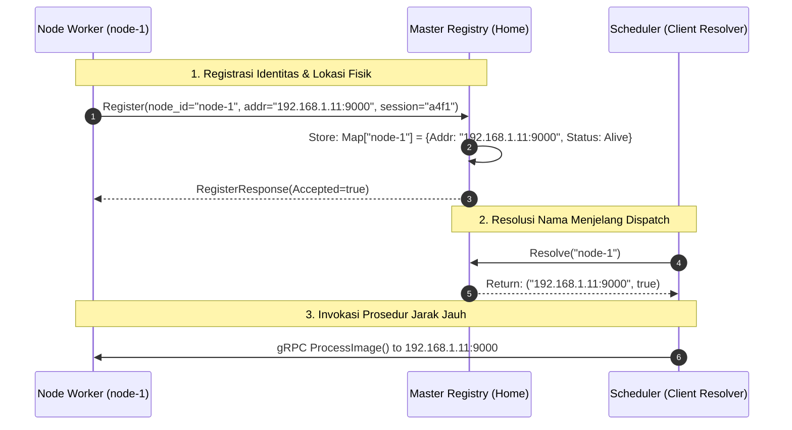
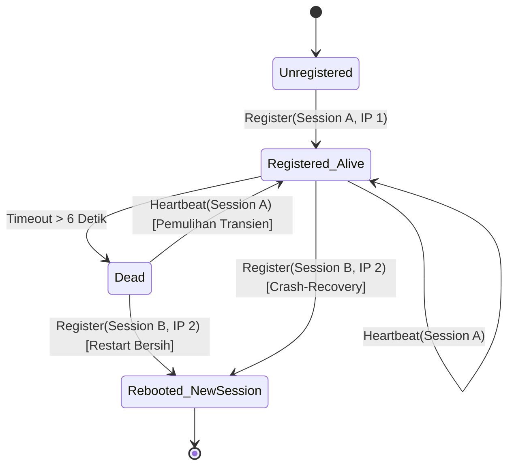

# Layanan Penamaan (Naming System) — distapi

Dalam rekayasa sistem terdistribusi, **Naming System** bertanggung jawab untuk memetakan nama entitas logis yang mudah dibaca (*human-readable* atau *opaque identifier*) menjadi alamat fisik (*network address*) yang dapat dirutekan oleh protokol komunikasi.

Dokumen ini menjelaskan implementasi pendekatan **Home-Based Naming** pada `distapi` serta integrasinya dengan pendeteksian kegagalan node.

---

## 1. Taksonomi Naming: Pendekatan Home-Based

Berdasarkan literatur sistem terdistribusi (Coulouris et al.; Tanenbaum & Van Steen), terdapat tiga paradigma utama penamaan:

1. **Broadcast/Multicast:** Klien memancarkan query penamaan ke seluruh subnet lokal (tidak berskala untuk jaringan luas).
2. **Forwarding Pointers:** Setiap perpindahan lokasi meninggalkan rantai penunjuk (*pointer*) ke lokasi baru.
3. **Home-Based Approach:** Entitas memiliki simpul asal (*Home*) yang permanen dan bertanggung jawab mencatat serta mengarahkan entitas bergerak menuju alamat fisiknya saat ini.

`distapi` mengadopsi **Home-Based Approach**:
* **Home Node:** Master (Laptop 1) bertindak sebagai *Home Location Register*.
* **Logical Identifier (Flat Name):** `NodeID` (misal: `"node-1"`).
* **Physical Address:** `AdvertiseAddr` (misal: `"192.168.1.11:9000"`).



---

## 2. Flat Naming vs Structured Naming

`distapi` memilih skema **Flat Naming** (nama tidak hierarkis):
* **Karakteristik:** Nama logis node (`node-1`, `node-2`, `laptop-fajar`) adalah string atomik tanpa struktur domain (bukan `node-1.region.dc.local`).
* **Keuntungan:** Tidak ada overhead parsing jalur direktori atau delegasi resolusi bertingkat; operasi resolusi berlangsung secara konstan $O(1)$ di dalam tabel hash memori Master.
* **Trade-off:** Memerlukan entitas terpusat (Master) untuk menjaga konsistensi direktori.

---

## 3. Penanganan Mutasi Alamat & Stale Session

Dalam jaringan Wi-Fi lokal dengan protokol DHCP, laptop worker berpotensi mengalami perubahan alamat IP saat terjadi pemutusan sementara (*transient disconnect*).



### Mitigasi Sesi Usang (Stale Session)
Ketika sebuah node mengalami *crash* dan dihidupkan kembali, kemungkinan besar socket TCP lama masih menggantung atau state internal node telah ter-reset.

1. Setiap node menghasilkan **SessionID kriptografis 4-byte acak** saat proses *booting*.
2. Pada saat RPC `Register` masuk ke Master:
   * Jika `NodeID` cocok dan `SessionID` identik: Master hanya memperbarui cap waktu dan alamat jaringan (rekonsiliasi transien).
   * Jika `NodeID` cocok namun `SessionID` berbeda: Master menyimpulkan bahwa node telah melakukan *reboot*. Koneksi lama di-close secara paksa dan seluruh metadata node diperbarui dari nol.

---

## 4. Keamanan Thread & Skalabilitas Resolusi

Implementasi pada `internal/registry/registry.go` menjamin keamanan konkurensi tingkat tinggi:

```go
type Registry struct {
    mu      sync.RWMutex
    nodes   map[string]*NodeInfo
    timeout time.Duration
}
```

* **Operasi Baca (`Resolve`, `AliveNodes`, `AllNodes`):** Menggunakan `RWMutex.RLock()`. Banyak goroutine scheduler dapat membaca alamat node secara paralel tanpa saling memblokir (*Read-Heavy Concurrency*).
* **Operasi Tulis (`Register`, `Heartbeat`, `TickDeadCheck`):** Menggunakan `RWMutex.Lock()` eksklusif dengan durasi penahanan kunci seminimal mungkin ($O(1)$ map lookup/update).
