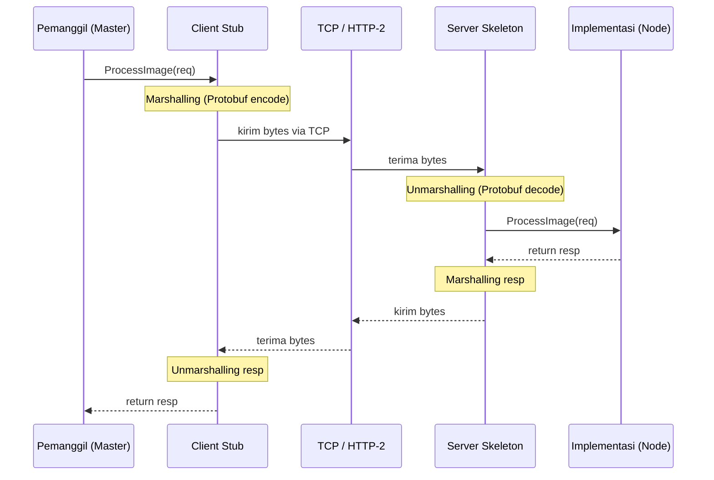
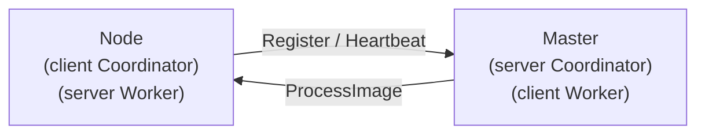
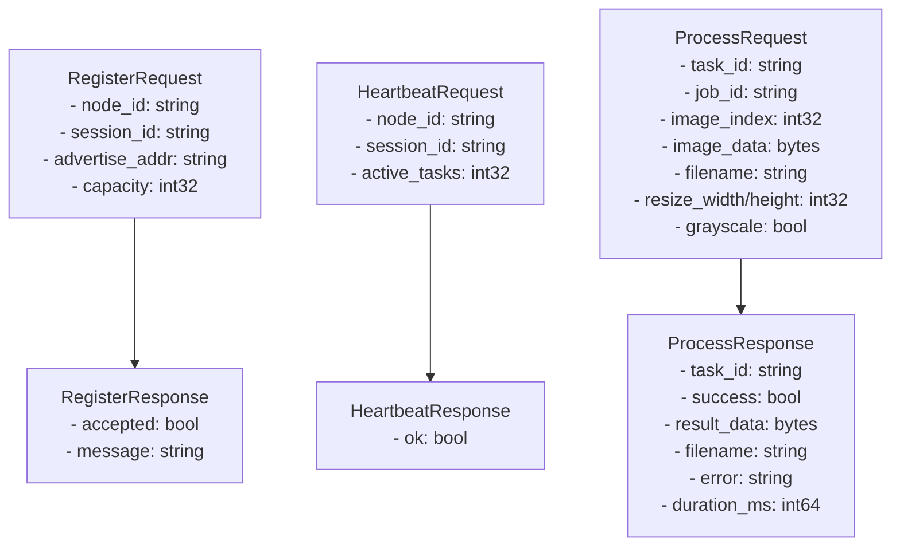
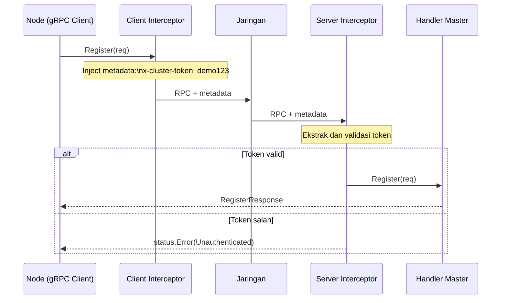
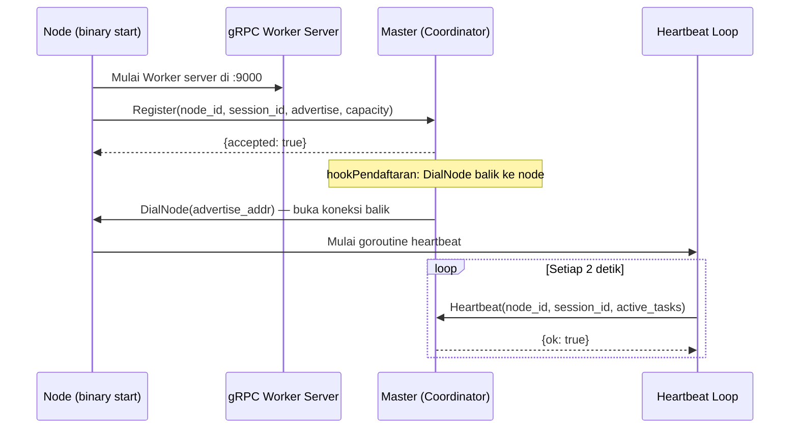

# RPC dan gRPC — distapi

## 1. Remote Procedure Call (RPC)

RPC adalah mekanisme yang memungkinkan proses memanggil prosedur di mesin lain seolah-olah lokal. Abstraksi ini menyembunyikan detail jaringan dari programmer.



### Tantangan RPC vs Fungsi Lokal

| Aspek | Fungsi Lokal | RPC |
|-------|-------------|-----|
| Latensi | Nanosecond | Milidetik (network RTT) |
| Kegagalan | Tidak ada | Timeout, network error, node crash |
| Serialisasi | Tidak perlu | Wajib (marshalling/unmarshalling) |
| Partial failure | Tidak ada | Bisa terjadi (caller tidak tahu apakah callee mati) |

Partial failure adalah tantangan utama RPC: caller tidak bisa membedakan apakah callee gagal *sebelum* atau *sesudah* memproses request. Ini yang mendorong semantik **at-least-once** di distapi.

## 2. Mengapa gRPC (bukan REST untuk Internal)?

gRPC dipilih untuk komunikasi *internal* (master ↔ node) dengan alasan:

| Aspek | REST + JSON | gRPC + Protobuf |
|-------|------------|-----------------|
| Encoding gambar (binary) | Base64 (+33% ukuran) | Binary langsung |
| Overhead header | HTTP/1.1 teks | HTTP/2 compressed |
| Code generation | Manual | Otomatis dari `.proto` |
| Type safety | Runtime | Compile-time |
| Untuk gambar 5 MB | ~6.6 MB via base64 | 5 MB langsung |

REST tetap dipakai untuk antarmuka *eksternal* (klien → master) karena lebih universal dan mudah di-test dengan `curl`.

## 3. Protocol Buffers — Definisi Service

File [`proto/cluster.proto`](../proto/cluster.proto) mendefinisikan dua service dengan arah panggilan yang berbeda:

```protobuf
// Coordinator: berjalan di MASTER, dipanggil NODE
// Arah: NODE → MASTER
service Coordinator {
  rpc Register(RegisterRequest) returns (RegisterResponse);
  rpc Heartbeat(HeartbeatRequest) returns (HeartbeatResponse);
}

// Worker: berjalan di setiap NODE, dipanggil MASTER
// Arah: MASTER → NODE
service Worker {
  rpc ProcessImage(ProcessRequest) returns (ProcessResponse);
}
```

Pemisahan dua service kritis karena arah panggilan berlawanan:



## 4. Message Types



## 5. Autentikasi via gRPC Metadata

Karena tidak menggunakan TLS (DESIGN.md §13.4 — *future work*), autentikasi dilakukan dengan **shared token** yang disisipkan ke metadata setiap RPC call.



Implementasi:
```go
// Server interceptor — validasi sebelum handler
func UnaryTokenServerInterceptor(token string) grpc.UnaryServerInterceptor {
    return func(ctx context.Context, req any, _ *grpc.UnaryServerInfo,
        handler grpc.UnaryHandler) (any, error) {
        md, _ := metadata.FromIncomingContext(ctx)
        if vals := md.Get("x-cluster-token"); len(vals) == 0 || vals[0] != token {
            return nil, status.Error(codes.Unauthenticated, "token tidak valid")
        }
        return handler(ctx, req)
    }
}
```

## 6. Sequence Startup Node



## 7. Semantik Eksekusi: At-Least-Once

gRPC unary digunakan (bukan streaming). Timeout per task: 30 detik (konfigurabel). Jika timeout tercapai atau node mati, task di-retry ke node lain — menghasilkan semantik **at-least-once**.

Task yang sama bisa dieksekusi dua kali bersamaan (stale RUNNING + retry baru). Ini aman karena `worker.Process()` bersifat deterministik dan `storage.SaveResult()` menggunakan atomic rename — **first-result-wins**.

> Lihat [`fault-tolerance.md`](fault-tolerance.md) untuk detail mekanisme retry dan reschedule.
