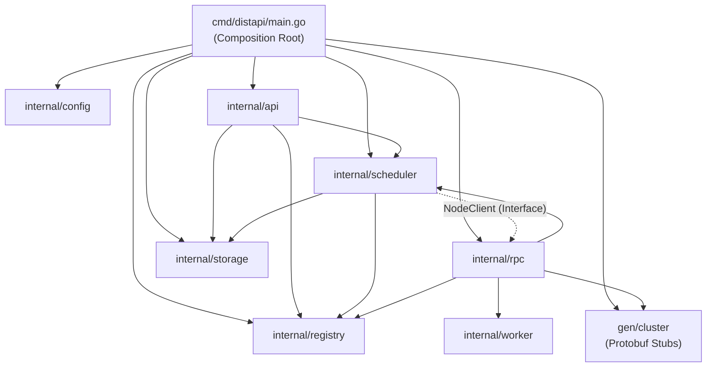

# Struktur Direktori & Arsitektur Kode — distapi

Dokumen ini membedah arsitektur kode sumber `distapi`, tanggung jawab setiap package, prinsip desain yang diadopsi, serta batasan ketergantungan (*dependency hierarchy*).

## 1. Tata Letak Direktori (Standard Go Project Layout)

```text
distapi/
  cmd/
    distapi/
      main.go               # Titik masuk runtime, kompilasi binary, & koordinasi graceful shutdown
  proto/
    cluster.proto           # Kontrak formal interface IDL Protocol Buffers v3
  gen/
    cluster/
      cluster.pb.go         # Struct data Protobuf yang di-generate / hand-crafted
      cluster_grpc.pb.go    # Service interface Coordinator & Worker gRPC
  internal/                 # Domain internal terlindungi (hanya bisa diakses modul distapi)
    config/                 # Evaluasi konfigurasi fail-fast (Flag > Env > Default)
    storage/                # Abstraksi persistensi file lokal berbasis Atomic Write
    registry/               # Home-Based Naming Service & Heartbeat Failure Detector
    worker/                 # Logika murni pemrosesan citra digital (Stateless)
    scheduler/              # Algoritma orkestrasi Scatter-Gather & penjadwalan ulang
    rpc/                    # Server & Client gRPC, Interceptor Autentikasi Token
    api/                    # RESTful API Gateway (Go 1.22+ Standard Mux)
  web/                      # Frontend Vue 3 + Vite
    embed.go                # //go:embed semua aset web/dist ke biner (single binary)
    src/                    # Kode sumber Vue (main.js, App.vue, components/, api.js)
    dist/                   # Hasil build Vite — DI-COMMIT agar `go build` tanpa Node.js
  docs/                     # Dokumentasi mendalam prinsip Sistem Terdistribusi
  Makefile                  # Automation tooling untuk environment Windows PowerShell / CMD
  go.mod                    # Definisi modul dan dependensi eksternal
  go.sum                    # Checksum verifikasi integritas dependensi
  README.md                 # Rangkuman eksekutif, identitas tim, & tautan panduan
```

## 2. Diagram Hirarki & Ketergantungan Modul

Desain package menerapkan prinsip **Clean Architecture / Hexagonal Ports & Adapters** untuk menghindari ketergantungan sirkular (*circular dependency*):



> **Catatan Kritis Arsitektural:** `internal/scheduler` mendefinisikan antarmuka `NodeClient` secara mandiri. Package scheduler sama sekali tidak mengimpor `internal/rpc`. Adapter konkret yang mengimplementasikan pemanggilan jaringan gRPC berada pada `internal/rpc/nodeclient.go`. Ini menjamin scheduler dapat diuji (*mocking*) secara independen tanpa memicu koneksi socket nyata.

## 3. Rincian Tanggung Jawab Package

### `cmd/distapi/main.go`
* **Peran:** *Composition Root* & Orchestrator.
* **Fungsi Kunci:**
  - Mengevaluasi argumen baris perintah via `config.Parse()`.
  - Menginisialisasi seluruh dependensi struktural (`Store`, `Registry`, `Scheduler`, `Server`).
  - Mengelola *Goroutine Lifecycle* untuk pemantauan node mati (`monitorNodeMati`) dan pembersihan TTL (`pembersihJobTTL`).
  - Menangkap sinyal OS (`SIGINT`, `SIGTERM`) menggunakan `signal.NotifyContext` untuk melakukan *Graceful Shutdown* dalam jendela 10 detik.

### `internal/config`
* **Peran:** Manajemen konfigurasi 12-Factor App.
* **Fungsi Kunci:**
  - Mengisolasi konfigurasi dari kode sumber.
  - Membaca hierarki nilai: Flag CLI (`--token`) > Environment Variables (`DISTAPI_TOKEN`) > Nilai Default.
  - Menjalankan *fail-fast validation*: binary langsung keluar dengan kode status 1 dan pesan deskriptif jika parameter wajib tidak terpenuhi.

### `internal/storage`
* **Peran:** Pengelola persistensi berkas citra mentah dan terproses di node Master.
* **Fungsi Kunci:**
  - Mengimplementasikan pola **Atomic Write**: berkas ditulis terlebih dahulu ke nama berkas sementara (`.tmp-*`), di-flush ke disk, kemudian di-rename ke path target secara atomik.
  - Menjamin pembaca paralel (klien HTTP atau goroutine worker) tidak akan pernah membaca data parsial atau berkas korup.
  - Dilengkapi mekanisme *retry backoff* untuk menangani *mandatory file lock* pada sistem berkas Windows NTFS.

### `internal/registry`
* **Peran:** Implementasi *Home-Based Naming Service* dan *Failure Detector*.
* **Fungsi Kunci:**
  - Menyimpan pemetaan thread-safe (`sync.RWMutex`) antara nama logis node (`NodeID`) dengan alamat jaringan fisiknya (`AdvertiseAddr`).
  - Menggunakan `SessionID` (token acak 4-byte) untuk mendeteksi *reboot* node dan mencegah *stale entry*.
  - Menjalankan algoritma deteksi kegagalan berbasis *heartbeat sliding window*: node yang tidak memperbarui sinyal dalam jendela waktu `NodeTimeout` (6 detik) diklasifikasikan sebagai `StatusDead`.

### `internal/worker`
* **Peran:** Pemroses citra digital deterministik dan murni (*pure function*).
* **Fungsi Kunci:**
  - Stateless: tidak memiliki state internal atau dependensi jaringan.
  - Mendukung operasi konversi warna grayscale (formula luminansi ITU-R BT.601) dan *nearest-neighbour aspect-ratio-preserving resizing*.
  - Dirancang idempoten: eksekusi berulang terhadap citra yang sama dengan opsi identik selalu menghasilkan output yang sama secara deterministik.

### `internal/scheduler`
* **Peran:** Orkestrator algoritma *Scatter-Gather*.
* **Fungsi Kunci:**
  - **Scatter:** Memecah 1 *Job* menjadi $N$ *Task*, mendistribusikan task secara konkuren menggunakan goroutine ke node worker melalui algoritma *Round-Robin*.
  - **Gather:** Menunggu penyelesaian seluruh task via `sync.WaitGroup`, menghitung durasi, dan menetapkan status akhir agregat (`DONE` atau `FAILED`).
  - **Fault Resilience:** Mendeteksi node yang gugur melalui sinyal registry, mereset status task dari `RUNNING` menjadi `PENDING`, dan melakukan *rescheduling* otomatis hingga ambang `MaxRetries` (maksimal 3 kali).

### `internal/rpc`
* **Peran:** Lapisan komunikasi antar-proses terdistribusi (*Transport Layer*).
* **Fungsi Kunci:**
  - Mengoperasikan `CoordinatorServer` (sisi Master) dan `WorkerServer` (sisi Node).
  - Menyediakan *Unary Client/Server Interceptor* untuk validasi shared secret token pada setiap frame panggilan gRPC.
  - Menyediakan `NodeClientAdapter` dengan kemampuan *connection reuse / caching* dan *graceful degradation* (eksekusi lokal di Master jika seluruh Node mati).

### `internal/api`
* **Peran:** Gerbang antarmuka pengguna luar (*External Gateway*).
* **Fungsi Kunci:**
  - Melayani 7 endpoint RESTful API berbasis router native Go 1.22+ (`http.NewServeMux`).
  - Mengembalikan status `202 Accepted` untuk pemrosesan asinkron (klien melakukan *polling*).
  - Streaming berkas hasil langsung dari disk ke response writer HTTP dengan konsumsi memori konstan ($O(1)$ memory streaming).
  - Menyajikan antarmuka web Vue (hasil build `web/dist` yang di-embed via package `distapi/web`) pada akar path `/`, sehingga satu biner berisi API dan UI.
