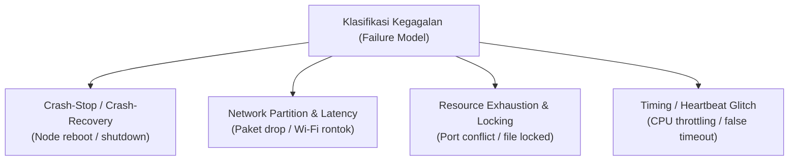

# Troubleshooting & Panduan Pemulihan Kegagalan — distapi

Dokumen ini menyajikan matriks mitigasi kegagalan pada lingkungan **Sistem Terdistribusi** yang berjalan secara *native* di sistem operasi **Windows 10 / 11**. Fokus utama diarahkan pada anomali jaringan lokal (LAN/WLAN), konkurensi I/O Windows, dan kegagalan parsial node.

---

## 1. Taksonomi Kegagalan Sistem Terdistribusi

Dalam model sistem terdistribusi asinkron, distapi mengantisipasi kategori kegagalan berikut:



---

## 2. Matriks Permasalahan dan Solusi Cepat

| Kategori | Gejala / Pesan Error | Akar Masalah | Tindakan Perbaikan |
| :--- | :--- | :--- | :--- |
| **Jaringan** | `Test-NetConnection : TcpTestSucceeded : False` atau `dial tcp ... connectex: A connection attempt failed` | Port diblokir Windows Firewall atau fitur *Client Isolation* Wi-Fi aktif | Buka port via PowerShell Admin atau ganti jaringan ke Wi-Fi Hotspot HP |
| **Alamat IP** | Node gagal terhubung setelah reconnect Wi-Fi | DHCP memberikan IP baru (IP lama kedaluwarsa) | Cek `ipconfig`, jalankan ulang node dengan IP `--advertise` dan `--master` baru |
| **Port Binding** | `bind: Only one usage of each socket address (protocol/network address/port) is normally permitted` | Port 9000 atau 8080 masih terkunci oleh proses sebelumnya (zombie) | Identifikasi PID via `Get-NetTCPConnection` dan matikan dengan `Stop-Process` |
| **Filesystem** | `storage: rename gagal: ... Access is denied` | Windows memegang *mandatory file lock* pada file yang sedang dibuka | Sistem sudah memiliki built-in retry backoff; pastikan direktori memiliki izin *write* |
| **Heartbeat** | Log master: `node dinyatakan mati` padahal laptop node masih menyala | Beban CPU 100% atau latensi Wi-Fi > 6 detik | Sesuaikan `--node-timeout=10s` dan `--heartbeat-interval=3s` |
| **Payload** | `rpc error: code = ResourceExhausted desc = received message larger than max` | Gambar melebihi batas buffer gRPC | Upload dibatasi maksimal 5 MB/gambar; buffer internal diset 8 MB |

---

## 3. Prosedur Diagnostik & Solusi Mendalam

### Skenario A: Isolasi Klien Wi-Fi Kampus (AP Client Isolation)

* **Indikasi:** Laptop Master dan Node sama-sama terhubung ke Wi-Fi kampus yang sama, tetapi perintah `ping <IP_MASTER>` menghasilkan `Request timed out` atau gRPC dial gagal instan.
* **Akar Masalah:** Router institusi/kampus mengaktifkan fitur keamanan *AP Client Isolation* yang melarang komunikasi langsung antar host nirkabel dalam satu subnet.
* **Solusi Operasional:**
  1. Matikan Wi-Fi kampus pada ke-4 laptop.
  2. Aktifkan **Personal Hotspot / Tethering** dari 1 unit smartphone.
  3. Hubungkan ke-4 laptop ke hotspot tersebut.
  4. Jalankan diagnostik PowerShell berikut dari laptop Node ke Master:
     ```powershell
     Test-NetConnection -ComputerName 192.168.43.10 -Port 9000
     ```
  5. Pastikan parameter `TcpTestSucceeded : True` muncul sebelum menjalankan node.

---

### Skenario B: Windows Defender Firewall Memblokir Port Masuk (Inbound Block)

* **Indikasi:** Master dapat mem-ping Node, tetapi RPC `Register` dari Node ditolak atau tidak ada respons (*timeout*).
* **Akar Masalah:** Profil jaringan Windows berada pada mode *Public*, sehingga koneksi masuk (*inbound*) ke port 8080 dan 9000 diblokir secara bawaan.
* **Solusi Operasional (Jalankan PowerShell sebagai Administrator):**
  ```powershell
  # Izinkan port komunikasi internal antar node (gRPC)
  New-NetFirewallRule -DisplayName "distapi-gRPC-Inbound" `
    -Direction Inbound -Protocol TCP -LocalPort 9000 -Action Allow -Profile Any

  # Izinkan port REST API untuk Klien / Pengujian
  New-NetFirewallRule -DisplayName "distapi-HTTP-Inbound" `
    -Direction Inbound -Protocol TCP -LocalPort 8080 -Action Allow -Profile Any
  ```
  Untuk memverifikasi rule yang aktif:
  ```powershell
  Get-NetFirewallRule -DisplayName "distapi*" | Format-Table DisplayName, Enabled, Direction, Action
  ```

---

### Skenario C: Konflik Alokasi Port (*Port Collision* / Zombie Process)

* **Indikasi:** Saat mengeksekusi binary, muncul pesan error:
  `panic: rpc: listen :9000 gagal: bind: Only one usage of each socket address...`
* **Akar Masalah:** Eksekusi binary sebelumnya dihentikan secara paksa (misal: penutupan jendela terminal tanpa graceful shutdown) sehingga socket OS masih menggantung pada status `TIME_WAIT` atau proses latar belakang belum mati.
* **Solusi Operasional:**
  ```powershell
  # 1. Cari PID proses yang menguasai port 9000
  $conn = Get-NetTCPConnection -LocalPort 9000 -ErrorAction SilentlyContinue
  if ($conn) {
      $pidNum = $conn.OwningProcess
      Write-Host "Port 9000 dikuasai PID: $pidNum"
      # 2. Hentikan proses tersebut secara paksa
      Stop-Process -Id $pidNum -Force
      Write-Host "Proses $pidNum berhasil dimatikan."
  } else {
      Write-Host "Port 9000 bersih."
  }
  ```

---

### Skenario D: Mandatory File Locking pada Windows NTFS

* **Indikasi:** Log Master mencatat:
  `level=ERROR msg="simpan hasil gagal" error="storage: rename gagal: ... The process cannot access the file because it is being used by another process."`
* **Akar Masalah:** Tidak seperti Linux (POSIX *advisory locks*), Windows NTFS memberlakukan *mandatory file locking*. Jika antivirus (misal: Windows Defender Real-time Scan) atau goroutine pembaca lain sedang memeriksa file sementara `.tmp-*`, operasi `os.Rename` akan langsung ditolak OS.
* **Solusi Arsitektural & Mitigasi:**
  1. Package `internal/storage` sudah dilengkapi mekanisme pemulihan adaptif:
     ```go
     // internal/storage/storage.go
     for range 5 {
         if err := os.RemoveAll(dir); err == nil {
             return nil
         }
         time.Sleep(20 * time.Millisecond) // jeda untuk rilis lock OS
     }
     ```
  2. Pastikan direktori target `--data-dir` diletakkan di drive internal lokal (misal: `C:\Projects\dips-sister\data`), bukan di *Network Drive* atau folder sinkronisasi cloud (OneDrive / Google Drive).

---

### Skenario E: Deteksi Kematian Palsu (*False-Positive Dead Node*)

* **Indikasi:** Node masih menyala dan aktif, tetapi Master mencatat `node dinyatakan mati, task dijadwalkan ulang`.
* **Akar Masalah:** Laptop Node beralih ke mode hemat daya baterai (*Power Throttling*), mematikan adapter Wi-Fi sementara, atau CPU terbebani proses lain sehingga goroutine heartbeat tidak sempat berjalan dalam jendela 6 detik.
* **Solusi Penyesuaian Parameter (Toleransi Diperbesar):**
  Saat menjalankan Master, longgarkan batas *heartbeat timeout* menjadi 10–12 detik:
  ```powershell
  .\dist\distapi.exe --mode=master `
    --heartbeat-interval=2s `
    --node-timeout=10s `
    --token=demo123
  ```
  Pada Laptop Node, pastikan skema daya disetel ke **Best Performance** dan nonaktifkan fitur *sleep*:
  ```powershell
  powercfg /change standby-timeout-ac 0
  ```

---

### Skenario F: Seluruh Node Worker Runtuh (*Total Cluster Failure*)

* **Indikasi:** Seluruh laptop Node (2, 3, 4) mati atau terputus koneksinya secara bersamaan.
* **Tindakan Sistem:**
  1. Komponen `internal/scheduler` mendeteksi `len(registry.AliveNodes()) == 0`.
  2. Sistem **tidak melakukan panic** atau crash.
  3. Scheduler secara otomatis mengalihkan tugas ke node semu `master-local`.
  4. Komponen `internal/rpc/nodeclient.go` mengeksekusi pemrosesan secara *in-process* menggunakan sisa kapasitas komputasi laptop Master (*Graceful Degradation*).
* **Verifikasi Operasional:**
  Klien tetap dapat melakukan request upload dan polling status. Task akan tetap berstatus `DONE` meskipun diproses lebih lambat secara lokal di laptop 1.

---

## 4. Skrip Pengecekan Kesehatan Pra-Demo (Pre-Flight Checklist)

Simpan dan jalankan skrip PowerShell berikut di Laptop Master sebelum presentasi/demo:

```powershell
Write-Host "=== PRE-FLIGHT CHECK DISTAPI (WINDOWS) ===" -ForegroundColor Cyan

# 1. Cek Kompiler Go
$goVer = go version 2>$null
if ($LASTEXITCODE -eq 0) {
    Write-Host "[OK] Go terinstal: $goVer" -ForegroundColor Green
} else {
    Write-Host "[FAIL] Kompiler Go tidak terdeteksi di PATH!" -ForegroundColor Red
}

# 2. Cek Aturan Firewall
$fwRule = Get-NetFirewallRule -DisplayName "distapi*" -ErrorAction SilentlyContinue
if ($fwRule) {
    Write-Host "[OK] Aturan Windows Firewall ditemukan." -ForegroundColor Green
} else {
    Write-Host "[WARN] Aturan Firewall distapi belum dibuat! Rekomendasi: buka port 9000 & 8080." -ForegroundColor Yellow
}

# 3. Cek Kepemilikan Port 8080 & 9000
$p8080 = Get-NetTCPConnection -LocalPort 8080 -ErrorAction SilentlyContinue
$p9000 = Get-NetTCPConnection -LocalPort 9000 -ErrorAction SilentlyContinue

if ($p8080) { Write-Host "[WARN] Port 8080 sedang digunakan PID $($p8080.OwningProcess)" -ForegroundColor Yellow }
else { Write-Host "[OK] Port 8080 tersedia." -ForegroundColor Green }

if ($p9000) { Write-Host "[WARN] Port 9000 sedang digunakan PID $($p9000.OwningProcess)" -ForegroundColor Yellow }
else { Write-Host "[OK] Port 9000 tersedia." -ForegroundColor Green }

Write-Host "==========================================" -ForegroundColor Cyan
```
